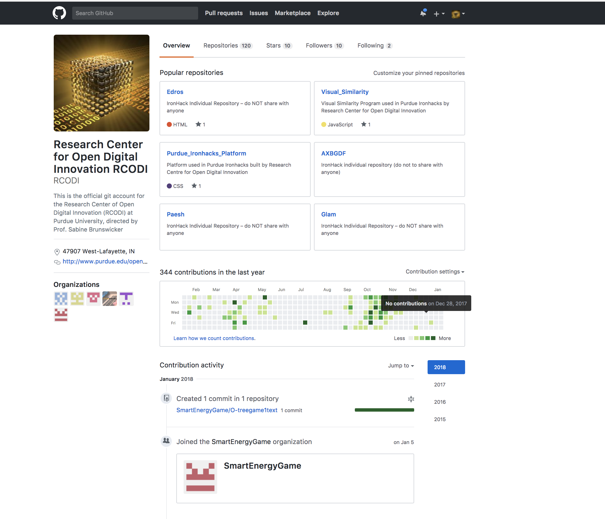
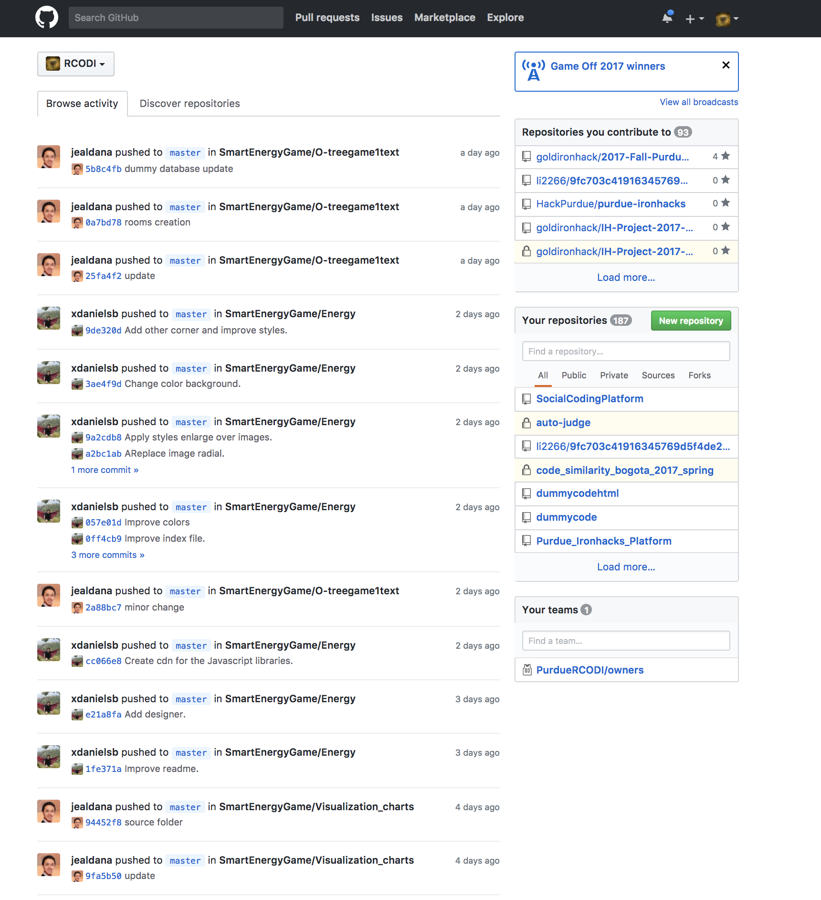

## Data And Code

As a result of the projects developed, the generation of useful data is part of our activities. Feel free to learn more about of our projects from the data perspective.

## IronHacks

This project is to provide a new perspective on how to promote impact from governmental OD. Using machine readable open datasets from [Data.gov ](http://www.data.gov/) we conduct an empirical quantitative study to explain the effect of* innovation performance transparency *and* solution  transparency *on governmental OD impact.

## Smart Energy 

By extract granular perceptual, behavioral and interaction data using new data collection techniques, empirical and experimental studies, and will create tangible artifacts.

## Open Source Software Redhat

This project looks to understand how Open Source Software practices are evolving by focusing on studying a prominent community &#x2018;OpenStack' that is effectively using the latest practices.

## Our Code

Here you can look for the data code and sources that are related to the projects.

