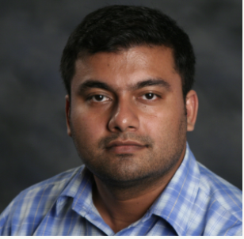
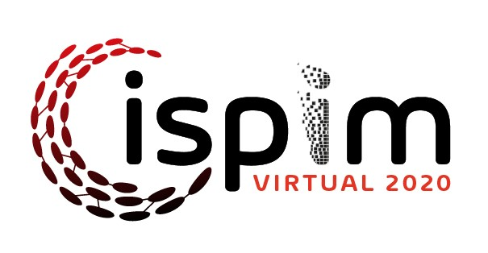
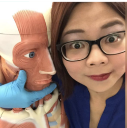
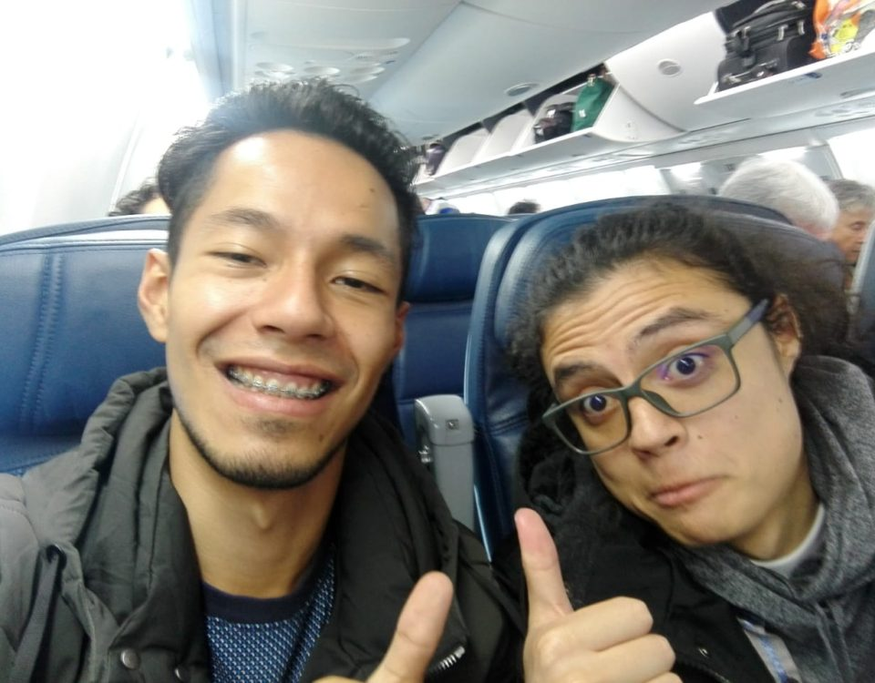
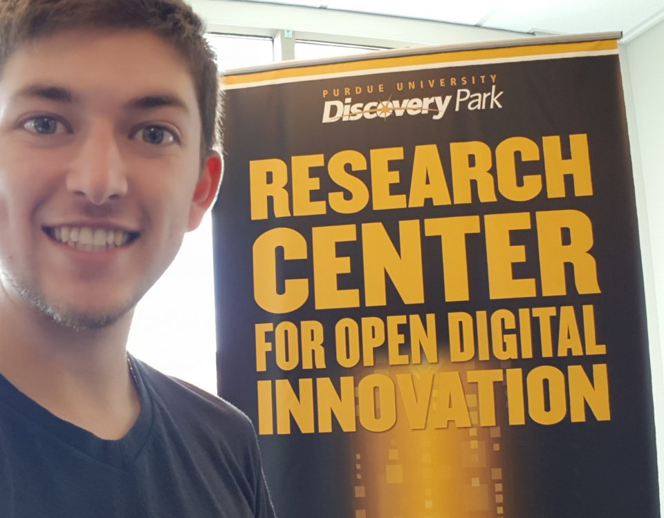
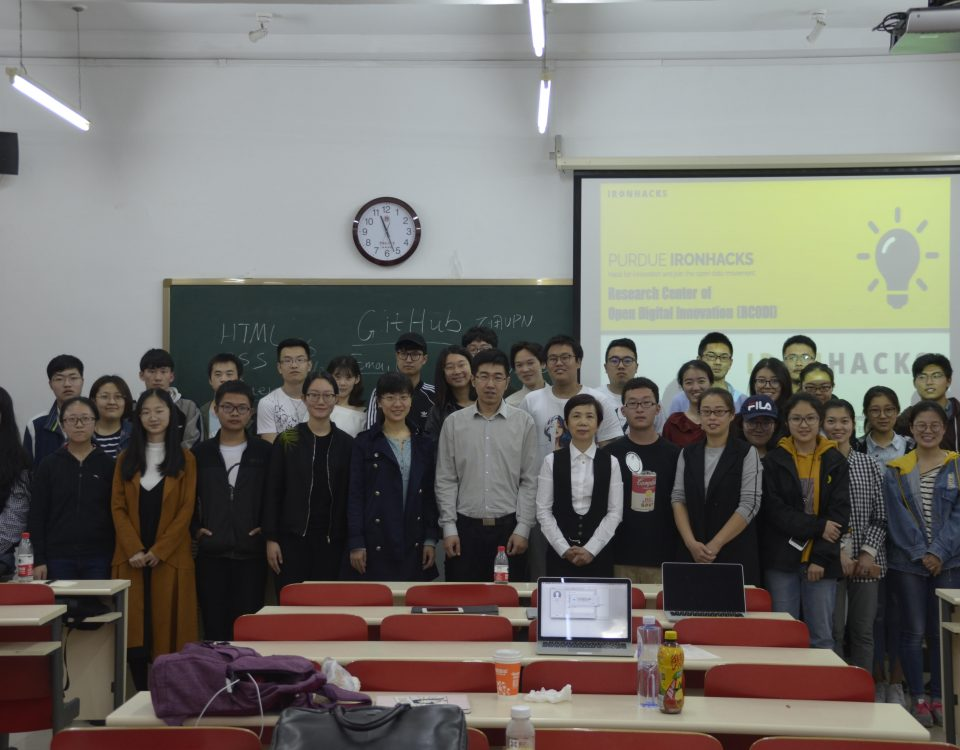
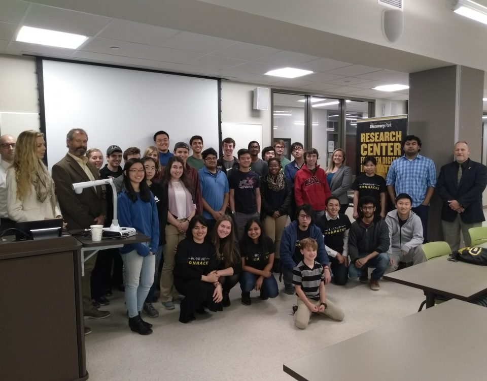
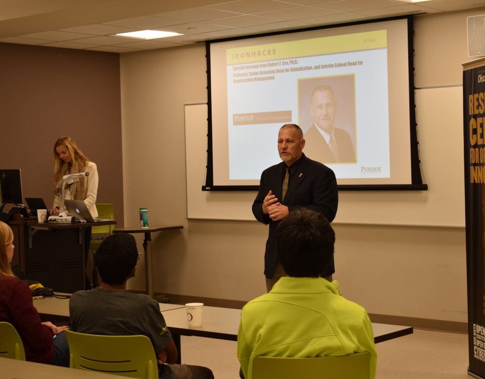

[vc_row][vc_column][vc_empty_space][vc_custom_heading text=&#x201D;NEWS&#x201D; font_container=&#x201D;tag:h3|text_align:center&#x201D; use_theme_fonts=&#x201D;yes&#x201D;][vc_column_text]All the activities related to RCODI.org[/vc_column_text][/vc_column][/vc_row][vc_row][vc_column]

August 29, 2020

[https://rcodi.org/wp-content/uploads/2020/08/ProfSabine_Covid_EdSurge.jpg](https://rcodi.org/wp-content/uploads/2020/08/ProfSabine_Covid_EdSurge.jpg)[https://rcodi.org/new-edsurge-podcast-series-features-rcodi-director/](https://rcodi.org/new-edsurge-podcast-series-features-rcodi-director/)

## [New EdSurge Podcast Series Features RCODI Director](https://rcodi.org/new-edsurge-podcast-series-features-rcodi-director/)

In a new podcast series from EdSurge, RCODI Director, Professor Sabine Brunswicker, shares her experience teaching at the Purdue Polytechnic [&#x2026;]

Do you like it?[0](#)

[Read more](https://rcodi.org/new-edsurge-podcast-series-features-rcodi-director/)

August 8, 2020

[https://rcodi.org/wp-content/uploads/2018/02/sabine.jpg](https://rcodi.org/wp-content/uploads/2018/02/sabine.jpg)[https://rcodi.org/rcodis-director-co-organizing-a-virtual-live-workshop-on-digital-transformation-at-aom/](https://rcodi.org/rcodis-director-co-organizing-a-virtual-live-workshop-on-digital-transformation-at-aom/)

## [RCODI&#x2019;s Director Co-organizing a Virtual LIVE workshop on Digital Transformation at AOM](https://rcodi.org/rcodis-director-co-organizing-a-virtual-live-workshop-on-digital-transformation-at-aom/)

Our director is participating on the 80th annual meeting of the Academy of Management. &#xA0; What&#x2019;s new is that this [&#x2026;]

Do you like it?[0](#)

[Read more](https://rcodi.org/rcodis-director-co-organizing-a-virtual-live-workshop-on-digital-transformation-at-aom/)

June 30, 2020

[https://rcodi.org/wp-content/uploads/2020/06/rcodi_ISPIMtalkPost-1024x683.jpg](https://rcodi.org/wp-content/uploads/2020/06/rcodi_ISPIMtalkPost-1024x683.jpg)[https://rcodi.org/thought-leadership-and-digital-innovation-in-times-of-crisis/](https://rcodi.org/thought-leadership-and-digital-innovation-in-times-of-crisis/)

## [Thought Leadership and Digital Innovation in Times of Crisis](https://rcodi.org/thought-leadership-and-digital-innovation-in-times-of-crisis/)

RCODI Director Sabine Brunswicker recently gave a keynote talk as part of ISPIM&#x2019;s virtual conference on responding to the COVID-19 [&#x2026;]

Do you like it?[0](#)

[Read more](https://rcodi.org/thought-leadership-and-digital-innovation-in-times-of-crisis/)

May 2, 2020

[https://rcodi.org/wp-content/uploads/2018/01/Screen-Shot-2018-01-09-at-2.34.50-PM.png](https://rcodi.org/wp-content/uploads/2018/01/Screen-Shot-2018-01-09-at-2.34.50-PM.png)[https://rcodi.org/research-on-a-theory-of-design-motifs/](https://rcodi.org/research-on-a-theory-of-design-motifs/)

## [Research on a &#x201C;Theory of Design Motifs&#x201D;](https://rcodi.org/research-on-a-theory-of-design-motifs/)

Our Director Sabine Brunswicker and RCODI fellow Satyam Mukherjee have been working on a paper that proposes a theory of [&#x2026;]

Do you like it?[0](#)

[Read more](https://rcodi.org/research-on-a-theory-of-design-motifs/)

April 24, 2020

[https://rcodi.org/wp-content/uploads/2020/04/ispim-webpost_apr20.jpg](https://rcodi.org/wp-content/uploads/2020/04/ispim-webpost_apr20.jpg)[https://rcodi.org/rcodi-director-to-present-virtual-keynote-at-ispim-conference/](https://rcodi.org/rcodi-director-to-present-virtual-keynote-at-ispim-conference/)

## [RCODI Director to Present Virtual Keynote at ISPIM Conference](https://rcodi.org/rcodi-director-to-present-virtual-keynote-at-ispim-conference/)

RCODI Director Sabine Brunswicker is scheduled to present a keynote talk on open digital innovation at the ISPIM Virtual Conference [&#x2026;]

Do you like it?[0](#)

[Read more](https://rcodi.org/rcodi-director-to-present-virtual-keynote-at-ispim-conference/)

April 13, 2020

[https://rcodi.org/wp-content/uploads/2018/05/cutmypic-1.png](https://rcodi.org/wp-content/uploads/2018/05/cutmypic-1.png)[https://rcodi.org/welcome-to-our-new-phd-student-at-rcodi/](https://rcodi.org/welcome-to-our-new-phd-student-at-rcodi/)

## [Welcome to our new PhD student at RCODI](https://rcodi.org/welcome-to-our-new-phd-student-at-rcodi/)

In May 2020, Jia Cheoh was accepted as PhD student of Professor Sabine Brunswicker. Jia will be graduating this semester [&#x2026;]

Do you like it?[0](#)

[Read more](https://rcodi.org/welcome-to-our-new-phd-student-at-rcodi/)

April 8, 2020

[https://rcodi.org/wp-content/uploads/2020/04/Screen-Shot-2020-04-09-at-10.18.46-PM.png](https://rcodi.org/wp-content/uploads/2020/04/Screen-Shot-2020-04-09-at-10.18.46-PM.png)[https://rcodi.org/plos-one-call-for-papers-cities-as-complex-systems/](https://rcodi.org/plos-one-call-for-papers-cities-as-complex-systems/)

## [PLOS ONE Call for Papers: Cities as Complex Systems](https://rcodi.org/plos-one-call-for-papers-cities-as-complex-systems/)

Cities are centers of human interactions and the innovations that arise from them. Urbanization has led to many positive developments [&#x2026;]

Do you like it?[0](#)

[Read more](https://rcodi.org/plos-one-call-for-papers-cities-as-complex-systems/)

October 25, 2019

[https://rcodi.org/wp-content/uploads/2019/10/WhatsApp-Image-2019-10-24-at-09.10.58-1024x768.jpeg](https://rcodi.org/wp-content/uploads/2019/10/WhatsApp-Image-2019-10-24-at-09.10.58-1024x768.jpeg)[https://rcodi.org/new-scholar-assistants-from-colombia-arrive-to-rcodi/](https://rcodi.org/new-scholar-assistants-from-colombia-arrive-to-rcodi/)

## [New scholar assistants from Colombia arrived to RCODI](https://rcodi.org/new-scholar-assistants-from-colombia-arrive-to-rcodi/)

New scholar assistants from Colombia arrived to RCODI After running the last version of The Ironhacks contest at Universidad Nacional [&#x2026;]

Do you like it?[0](#)

[Read more](https://rcodi.org/new-scholar-assistants-from-colombia-arrive-to-rcodi/)

March 27, 2019

[https://rcodi.org/wp-content/uploads/2018/02/sabine.jpg](https://rcodi.org/wp-content/uploads/2018/02/sabine.jpg)[https://rcodi.org/ironhacks-2019/](https://rcodi.org/ironhacks-2019/)

## [Officially Full Professor &#x2013; Congratulations to Our Director](https://rcodi.org/ironhacks-2019/)

Do you like it?[0](#)

[Read more](https://rcodi.org/ironhacks-2019/)

December 21, 2018

[https://rcodi.org/wp-content/uploads/2018/03/11_3-2X1-1024x512.jpg](https://rcodi.org/wp-content/uploads/2018/03/11_3-2X1-1024x512.jpg)[https://rcodi.org/open-source/](https://rcodi.org/open-source/)

## [Understanding collaboration in open source platforms](https://rcodi.org/open-source/)

Do you like it?[0](#)

[Read more](https://rcodi.org/open-source/)

November 12, 2018

[https://rcodi.org/wp-content/uploads/2018/11/Capture-1024x524.png](https://rcodi.org/wp-content/uploads/2018/11/Capture-1024x524.png)[https://rcodi.org/nudging/](https://rcodi.org/nudging/)

## [Nudging people in good behavior with data: the opportunity of &#x201C;white&#x201D; design patterns in social data visualizations](https://rcodi.org/nudging/)

Do you like it?[0](#)

[Read more](https://rcodi.org/nudging/)

September 26, 2018

[https://rcodi.org/wp-content/uploads/2018/03/CODE-2X1-1024x512.jpg](https://rcodi.org/wp-content/uploads/2018/03/CODE-2X1-1024x512.jpg)[https://rcodi.org/fellowship2019/](https://rcodi.org/fellowship2019/)

## [IronHacks Fellowship Fall 2018](https://rcodi.org/fellowship2019/)

Do you like it?[0](#)

[Read more](https://rcodi.org/fellowship2019/)

September 11, 2018

[https://rcodi.org/wp-content/uploads/2018/07/VIENNA.jpg](https://rcodi.org/wp-content/uploads/2018/07/VIENNA.jpg)[https://rcodi.org/austria-university-conference-2019-open-science-and-open-data-talk-sept-11/](https://rcodi.org/austria-university-conference-2019-open-science-and-open-data-talk-sept-11/)

## [Austria University Conference 2019 open science and open data, talk Sept 11](https://rcodi.org/austria-university-conference-2019-open-science-and-open-data-talk-sept-11/)

Do you like it?[0](#)

[Read more](https://rcodi.org/austria-university-conference-2019-open-science-and-open-data-talk-sept-11/)

August 25, 2018

[https://rcodi.org/wp-content/uploads/2018/03/CODE-2X1-1024x512.jpg](https://rcodi.org/wp-content/uploads/2018/03/CODE-2X1-1024x512.jpg)[https://rcodi.org/fellowship2018/](https://rcodi.org/fellowship2018/)

## [IronHacks Fellowship Fall 2018](https://rcodi.org/fellowship2018/)

Do you like it?[0](#)

[Read more](https://rcodi.org/fellowship2018/)

August 22, 2018

[https://rcodi.org/wp-content/uploads/2018/08/Degly-Cropped-1024x1024.jpg](https://rcodi.org/wp-content/uploads/2018/08/Degly-Cropped-1024x1024.jpg)[https://rcodi.org/welcome-degly/](https://rcodi.org/welcome-degly/)

## [RCODI welcomes our new IronHacks fellow Degly Pava from Bogota](https://rcodi.org/welcome-degly/)

Do you like it?[0](#)

[Read more](https://rcodi.org/welcome-degly/)

August 21, 2018

[https://rcodi.org/wp-content/uploads/2018/03/9_2-2X1-1024x512.jpg](https://rcodi.org/wp-content/uploads/2018/03/9_2-2X1-1024x512.jpg)[https://rcodi.org/ironhacks-on-the-news/](https://rcodi.org/ironhacks-on-the-news/)

## [IronHacks in the News](https://rcodi.org/ironhacks-on-the-news/)

Do you like it?[0](#)

[Read more](https://rcodi.org/ironhacks-on-the-news/)

July 4, 2018

[https://rcodi.org/wp-content/uploads/2016/05/sabine.jpg](https://rcodi.org/wp-content/uploads/2016/05/sabine.jpg)[https://rcodi.org/5346-2/](https://rcodi.org/5346-2/)

## [Our director gives keynote at global open science conference in Vienna on September, 9 2018.](https://rcodi.org/5346-2/)

Do you like it?[0](#)

[Read more](https://rcodi.org/5346-2/)

May 3, 2018

[https://rcodi.org/wp-content/uploads/2018/05/energy.gif](https://rcodi.org/wp-content/uploads/2018/05/energy.gif)[https://rcodi.org/the-future-starts-now/](https://rcodi.org/the-future-starts-now/)

## [Using visualizations to nudge people into better choices](https://rcodi.org/the-future-starts-now/)

Check out our demo app link and read more about the project here.

Do you like it?[0](#)

[Read more](https://rcodi.org/the-future-starts-now/)

April 24, 2018

[https://rcodi.org/wp-content/uploads/2018/04/CUPL-kickoff-1024x678.jpg](https://rcodi.org/wp-content/uploads/2018/04/CUPL-kickoff-1024x678.jpg)[https://rcodi.org/purdue-cupl-kickoff-spring-2018/](https://rcodi.org/purdue-cupl-kickoff-spring-2018/)

## [Purdue &#x2013; CUPL Kickoff Spring 2018](https://rcodi.org/purdue-cupl-kickoff-spring-2018/)

#&#x200E;IronHack&#x202C;s Purdue &#x2013;China University of Political Science and Law&#xA0;(CUPL) officially kicked off on Saturday, April 21st, 2018!

Do you like it?[0](#)

[Read more](https://rcodi.org/purdue-cupl-kickoff-spring-2018/)

April 14, 2018

[https://rcodi.org/wp-content/uploads/2018/03/BITCOIN-2X1-1024x512.png](https://rcodi.org/wp-content/uploads/2018/03/BITCOIN-2X1-1024x512.png)[https://rcodi.org/course_blockchain/](https://rcodi.org/course_blockchain/)

## [NEW COURSE! BLOCKCHAINS, NETWORKS, PEOPLE](https://rcodi.org/course_blockchain/)

CALL OUT!!!! You are all invited&#xA0;to come by the Blockchain, Networks, People Callout &#xA0;Mon. Apr. 16, 5:00 PM LOCATION:&#xA0;RCODI Economics [&#x2026;]

Do you like it?[0](#)

[Read more](https://rcodi.org/course_blockchain/)

January 8, 2018

[https://rcodi.org/wp-content/uploads/2016/05/sabine.jpg](https://rcodi.org/wp-content/uploads/2016/05/sabine.jpg)[https://rcodi.org/our-director-is-co-chair-of-icis-2018/](https://rcodi.org/our-director-is-co-chair-of-icis-2018/)

## [Our director is Co-Chair of ICIS 2018](https://rcodi.org/our-director-is-co-chair-of-icis-2018/)

Our director was selected as one of the panel track chairs of ICIS 2018!!! Read more here

Do you like it?[0](#)

[Read more](https://rcodi.org/our-director-is-co-chair-of-icis-2018/)

December 15, 2017

[https://rcodi.org/wp-content/uploads/2017/12/IMG_20171204_173529102-1024x768.jpg](https://rcodi.org/wp-content/uploads/2017/12/IMG_20171204_173529102-1024x768.jpg)[https://rcodi.org/mamaril-loeser-and-ko-take-top-honors/](https://rcodi.org/mamaril-loeser-and-ko-take-top-honors/)

## [Mamaril, Loeser, and Ko take top honors](https://rcodi.org/mamaril-loeser-and-ko-take-top-honors/)

The top honors at Purdue IronHack&#x2019;s Fall 2017 competition! Read more&#xA0;here

Do you like it?[0](#)

[Read more](https://rcodi.org/mamaril-loeser-and-ko-take-top-honors/)

December 6, 2017

[https://rcodi.org/wp-content/uploads/2017/12/DSC_0093-1-1024x683.jpg](https://rcodi.org/wp-content/uploads/2017/12/DSC_0093-1-1024x683.jpg)[https://rcodi.org/and-the-winners-are/](https://rcodi.org/and-the-winners-are/)

## [And the winners are &#x2026;](https://rcodi.org/and-the-winners-are/)

RCODI held an IronHacks Awards Ceremony to recognize the amazing work accomplished by 27 Purdue students.

Do you like it?[0](#)

[Read more](https://rcodi.org/and-the-winners-are/)

December 4, 2017

## [AND THE WINNER IS&#x2026;](https://rcodi.org/and-the-winner-is/)

Happening today! Don&#x2019;t miss the Purdue IronHacks Award Ceremony where three winners will walk off with great swag from the [&#x2026;]

Do you like it?[0](#)

[Read more](https://rcodi.org/and-the-winner-is/)

November 7, 2017

## [RCODI RESEARCH FELLOW SORIN ADAM MATEI: OUT WITH A NEW BOOK](https://rcodi.org/rcodi-research-fellow-sorin-adam-matei-out-with-a-new-book/)

Sorin Adam Matei, professor at Purdue University&#x2019;s Brian Lamb School of Communication, director of the Purdue Data Storytelling Network, and&#xA0;Research [&#x2026;]

Do you like it?[0](#)

[Read more](https://rcodi.org/rcodi-research-fellow-sorin-adam-matei-out-with-a-new-book/)

October 30, 2017

## [RCODI AND INDIANA HOUSING COLLABORATE ON SMART ENERGY PROJECT](https://rcodi.org/rcodi-and-indiana-housing-collaborate-on-smart-energy-project/)

Dr. Brunswicker and her PhD student Marlen Promann are working on a series of perceptual psychological experiments to advance our [&#x2026;]

Do you like it?[0](#)

[Read more](https://rcodi.org/rcodi-and-indiana-housing-collaborate-on-smart-energy-project/)

October 30, 2017

## [GOOD LUCK TO ALL OUR IRONHACKS CONTEST PARTICIPANTS!](https://rcodi.org/good-luck-to-all-our-ironhacks-contest-participants/)

Today is the big day! Good luck to all our students at Purdue and Universidad Nacional de Colombia&#xA0;participating in the [&#x2026;]

Do you like it?[0](#)

[Read more](https://rcodi.org/good-luck-to-all-our-ironhacks-contest-participants/)

October 30, 2017

## [MR. ARDEN L. BEMENT PAYS RCODI A VISIT](https://rcodi.org/mr-arden-l-bement-pays-rcodi-a-visit/)

RCODI had the honor of welcoming Mr. Arden L. Bement, former NSF Director and Founding RCODI Advisor to the center [&#x2026;]

Do you like it?[0](#)

[Read more](https://rcodi.org/mr-arden-l-bement-pays-rcodi-a-visit/)

September 27, 2017

## [MARLEN WITH NORTHWESTERN&#x2019;S VOLUNTEER SCIENCE PLATFORM](https://rcodi.org/marlen-with-northwesterns-volunteer-science-platform/)

RCODI PhD&#xA0;student Marlen Promann has been&#xA0;invited&#xA0;to become a Virtual Research&#xA0;Fellow at Northwestern&#x2019;s&#xA0;Volunteer Science. This fall, she&#xA0;will run a controlled experimental&#xA0;game [&#x2026;]

Do you like it?[0](#)

[Read more](https://rcodi.org/marlen-with-northwesterns-volunteer-science-platform/)

September 27, 2017

## [PROFESSOR NICKERSON TO SPEAK AT RCODI SYMPOSIUM 2017](https://rcodi.org/professor-nickerson-to-speak-at-rcodi-symposium-2017/)

Don&#x2019;t miss Professor Nickerson&#x2019;s talk on &#x201C;Collective Creativity and Open Design&#x201D; at the RCODI Symposium, Oct. 11, 2017!

Do you like it?[0](#)

[Read more](https://rcodi.org/professor-nickerson-to-speak-at-rcodi-symposium-2017/)

September 22, 2017

## [WELCOME NA CAO!](https://rcodi.org/welcome-na-cao/)

RCODI would like to warmly welcome Na Cao. After having completed her Postdoc at Tsinghua University in 2014, she became [&#x2026;]

Do you like it?[0](#)

[Read more](https://rcodi.org/welcome-na-cao/)

September 22, 2017

## [GETTING A SIGNATURE FOR THE OPEN DATA HACKING CLASS](https://rcodi.org/getting-a-signature-for-the-open-data-hacking-class/)

Please drop by&#xA0;Wang Hall&#xA0;to get Prof. Sabine Brunswicker&#x2019;s signature for Tech499 and HONR299 Open Data Hacking Class: Mondays, Room 4079, [&#x2026;]

Do you like it?[0](#)

[Read more](https://rcodi.org/getting-a-signature-for-the-open-data-hacking-class/)

September 19, 2017

## [NOW OFFERING IRONHACKS, OPEN DATA HACKING AT HONORS COLLEGE!](https://rcodi.org/now-offering-ironhacks-open-data-hacking-at-honors-college/)

Open Data Hacking has reached Honors College! Honors College students and students with a minimum 3.0 average qualify to register [&#x2026;]

Do you like it?[0](#)

[Read more](https://rcodi.org/now-offering-ironhacks-open-data-hacking-at-honors-college/)

September 8, 2017

## [JOIN US AT TECHTOWN-PURDUE!](https://rcodi.org/join-us-at-techtown-purdue/)

Want to know more about OPEN DATA HACKING-Tech499- the coolest programming class on campus? &#xA0;Join us tomorrow, September 9 from [&#x2026;]

Do you like it?[0](#)

[Read more](https://rcodi.org/join-us-at-techtown-purdue/)

September 6, 2017

## [WELCOME ABOARD YING AND TAKESHI!](https://rcodi.org/welcome-aboard-ying-and-takeshi/)

Ying and Takeshi, both visiting scholars from China and Japan, have finally arrived! They will both work in advancing the [&#x2026;]

Do you like it?[0](#)

[Read more](https://rcodi.org/welcome-aboard-ying-and-takeshi/)

August 29, 2017

## [TODAY! DATA & DESSERTS](https://rcodi.org/today-data-desserts/)

Interested in creating your own app?* Compete with the Honors College IronHack Team! Join us for Data & Desserts &#x2013; [&#x2026;]

Do you like it?[0](#)

[Read more](https://rcodi.org/today-data-desserts/)

August 22, 2017

## [TONIGHT! OPEN DATA HACKING-CALL OUT!](https://rcodi.org/tonight-open-data-hacking-call-out/)

Find out everything you need to know about the upcoming Open Data Hacking class being offered this October! TONIGHT, 6pm [&#x2026;]

Do you like it?[0](#)

[Read more](https://rcodi.org/tonight-open-data-hacking-call-out/)

August 7, 2017

## [FALL 2017 COURSE: OPEN DATA APPS DESIGN FOR SOCIAL IMPACT](https://rcodi.org/fall-2017-course-open-data-apps-design-for-social-impact/)

Hack for Innovation this Fall 2017! Don&#x2019;t miss out on the opportunity to learn how to develop innovative mash-ups &#xA0;and [&#x2026;]

Do you like it?[0](#)

[Read more](https://rcodi.org/fall-2017-course-open-data-apps-design-for-social-impact/)

August 7, 2017

## [PROFESSOR BRUNSWICKER CHAIRS SESSION AT AOM2017, ATLANTA](https://rcodi.org/professor-brunswicker-chairs-session-at-aom2017-atlanta/)

Professor Brunswicker set to chair AOM session on -Consumer and Producer Perspectives on Digital Innovation- at the Hyatt Regency, Atlanta&#x2019;s [&#x2026;]

Do you like it?[0](#)

[Read more](https://rcodi.org/professor-brunswicker-chairs-session-at-aom2017-atlanta/)

July 28, 2017

## [WELCOME DEAN WANG CHANGFENG!](https://rcodi.org/welcome-dean-wang-changfeng/)

RCODI welcomes Visiting Professor, Dean Wang Changfeng. He will&#xA0;focus on innovation in complex supply chain networks and innovation ecosystems using [&#x2026;]

Do you like it?[0](#)

[Read more](https://rcodi.org/welcome-dean-wang-changfeng/)

July 12, 2017

## [PROF. BRUNSWICKER PRESENTS TWO PAPERS AT IC2S2 CONFERENCE IN COLOGNE](https://rcodi.org/prof-brunswicker-presents-two-papers-at-ic2s2-conference-in-cologne/)

On July 12, 2017 our director&#xA0;Sabine Brunswicker&#xA0;presented 2 papers at the&#xA0;International Conference on Computational Social Science in Cologne. One paper [&#x2026;]

Do you like it?[0](#)

[Read more](https://rcodi.org/prof-brunswicker-presents-two-papers-at-ic2s2-conference-in-cologne/)

June 29, 2017

## [MEHDI BAGHERZADEH: HONORED BY THE 2017 EDAMABA](https://rcodi.org/mehdi-bagherzadeh-honored-by-the-2017-edamaba/)

Dr. Brunswicker&#x2019;s former student, Mehdi Bagherzadeh is being recognized for his PhD thesis: &#x201C;I am pleased and honoured that my [&#x2026;]

Do you like it?[0](#)

[Read more](https://rcodi.org/mehdi-bagherzadeh-honored-by-the-2017-edamaba/)

June 14, 2017

## [PROFESSOR SABINE BRUNSWICKER AT HCOMP, NY](https://rcodi.org/professor-sabine-brunswicker-at-hcomp-ny/)

Professor Sabine Brunswicker at HCOMP, NY Professor Brunswicker is serving on HCOMP&#x2019;s program committee in New York where she is [&#x2026;]

Do you like it?[0](#)

[Read more](https://rcodi.org/professor-sabine-brunswicker-at-hcomp-ny/)

June 12, 2017

## [PHD STUDENT MARLEN PROMANN TO PRESENT AT AMCIS 2017](https://rcodi.org/phd-student-marlen-promann-to-present-at-amcis-2017/)

Our PhD student Marlen Promann has been accepted for participation in the Doctoral consortia at AMCIS 2017. She will present [&#x2026;]

Do you like it?[0](#)

[Read more](https://rcodi.org/phd-student-marlen-promann-to-present-at-amcis-2017/)

June 1, 2017

## [RESEARCH PAPER ACCEPTED AT AMCIS 2017](https://rcodi.org/research-paper-accepted-at-amcis-2017/)

Marlen Promann, a Ph.D. candidate at RCODI and our director Dr. Brunswicker will be presenting their latest work on the [&#x2026;]

Do you like it?[0](#)

[Read more](https://rcodi.org/research-paper-accepted-at-amcis-2017/)

April 29, 2017

## [RESEARCH PAPER ACCEPTED AT IC2S2 2017](https://rcodi.org/research-paper-accepted-at-ic2s2-2017/)

This year&#x2019;s International Conference on Computational Social Science (IC2S2 2017) received a total of 298 submissions. Professor Sabine Brunswicker and [&#x2026;]

Do you like it?[0](#)

[Read more](https://rcodi.org/research-paper-accepted-at-ic2s2-2017/)

April 29, 2017

## [PROFESSOR SABINE BRUNSWICKER NOMINATED FOR TRACK CHAIR](https://rcodi.org/professor-sabine-brunswicker-nominated-for-track-chair/)

Our director at the Research Center for Open Digital Innovation has recently been nominated for the position of Track Chair [&#x2026;]

Do you like it?[0](#)

[Read more](https://rcodi.org/professor-sabine-brunswicker-nominated-for-track-chair/)

April 11, 2017

## [PURDUE INNOVATION SUMMIT](https://rcodi.org/purdue-innovation-summit/)

Catch Prof. Sabine Brunswicker and the students from the Research Center for Open Digital Innovation (RCODI) share their thoughts and [&#x2026;]

Do you like it?[0](#)

[Read more](https://rcodi.org/purdue-innovation-summit/)

April 10, 2017

## [THANK YOU, PROFESSOR SABINE!](https://rcodi.org/thank-you-professor-sabine/)

It marked one and a half year since I got to know Professor Sabine. Today is a special day as [&#x2026;]

Do you like it?[0](#)

[Read more](https://rcodi.org/thank-you-professor-sabine/)

March 22, 2017

## [IRONHACKS WEBSITE LAUNCH!](https://rcodi.org/ironhacks-website-launch/)

We are proud to announce the launch of our new IronHacks web platform. You can visit the IronHacks website for [&#x2026;]

Do you like it?[0](#)

[Read more](https://rcodi.org/ironhacks-website-launch/)

March 21, 2017

## [UPCOMING GDI EVENT ON MARCH 29TH](https://rcodi.org/upcoming-gdi-event-on-march-29th/)

Join us to learn about the Global Digital Innovation Program! WHEN:&#xA0;March 29th 2017, 6:30pm &#x2013; 8:30pm EST WHERE:&#xA0;ME 1130 WHO [&#x2026;]

Do you like it?[0](#)

[Read more](https://rcodi.org/upcoming-gdi-event-on-march-29th/)

March 19, 2017

## [PURDUE-PLATZI IRONHACKS](https://rcodi.org/purdue-platzi-ironhacks/)

Check out our new IronHack event in association with&#xA0;platzi.com! This hackathon is a great opportunity to use your creativity to [&#x2026;]

Do you like it?[0](#)

[Read more](https://rcodi.org/purdue-platzi-ironhacks/)

March 3, 2017

## [NEW ARTICLE ON CROWD-SOURCING PUBLISHED](https://rcodi.org/new-article-on-crowd-sourcing-published/)

Our new article on civic crowd-sourcing is published in the special issue on &#x201C;crowd-sourcing&#x201D;. Our director, Dr. Sabine Brunswicker and [&#x2026;]

Do you like it?[0](#)

[Read more](https://rcodi.org/new-article-on-crowd-sourcing-published/)

January 26, 2017

## [STUDENT WORKER FOR RESEARCH CENTER OF OPEN DIGITAL INNOVATION WANTED](https://rcodi.org/student-worker-for-research-center-of-open-digital-innovation-wanted/)

Student worker for Research Center of Open Digital Innovation wanted Join a great community of open data hackers and innovators! [&#x2026;]

Do you like it?[0](#)

[Read more](https://rcodi.org/student-worker-for-research-center-of-open-digital-innovation-wanted/)

October 7, 2016

## [RCODI VIDEO CHANNEL](https://rcodi.org/rcodi-video-channel/)

We are having more and more experts giving their hints about Open Source, Open Data and Open Innovation. This time, [&#x2026;]

Do you like it?[0](#)

[Read more](https://rcodi.org/rcodi-video-channel/)

September 11, 2016

## [NEW ARTICLE IN SCIENTOMETRICS ON THE SCIENTIFIC IMPACT IN DIGITAL SCIENTIFIC COMMUNITIES](https://rcodi.org/new-article-in-scientometrics-on-the-scientific-impact-in-digital-scientific-communities-2/)

Modern science has become collaborative and digital. The Internet has supported the emergence of scientific digital platforms that globally connect [&#x2026;]

Do you like it?[0](#)

[Read more](https://rcodi.org/new-article-in-scientometrics-on-the-scientific-impact-in-digital-scientific-communities-2/)

September 11, 2016

## [NEW ARTICLE IN SCIENTOMETRICS ON THE SCIENTIFIC IMPACT IN DIGITAL SCIENTIFIC COMMUNITIES](https://rcodi.org/new-article-in-scientometrics-on-the-scientific-impact-in-digital-scientific-communities/)

Modern science has become collaborative and digital. The Internet has supported the emergence of scientific digital platforms that globally connect [&#x2026;]

Do you like it?[0](#)

[Read more](https://rcodi.org/new-article-in-scientometrics-on-the-scientific-impact-in-digital-scientific-communities/)

May 5, 2016

## [RCODI STUDENT PLACES 2ND IN IOT CIVIC HACKATHON!](https://rcodi.org/rcodi-student-places-2nd-in-iot-civic-hackathon/)

Our very own Master&#x2019;s Student, Charles Song and his team placed 2nd last weekend in the first &#x201C;Internet of Things [&#x2026;]

Do you like it?[0](#)

[Read more](https://rcodi.org/rcodi-student-places-2nd-in-iot-civic-hackathon/)

February 22, 2016

## [ABE SYMPOSIUM AT DLRC A GREAT SUCCESS](https://rcodi.org/abe-symposium-at-dlrc-a-great-success/)

On a lovely Thursday morning and afternoon, Dr. Sabine Brunswicker delivered a plenary speech on the potential for Open Digital [&#x2026;]

Do you like it?[0](#)

[Read more](https://rcodi.org/abe-symposium-at-dlrc-a-great-success/)

February 11, 2016

## [VISITING STUDENT FROM JAPAN AT RCODI](https://rcodi.org/visiting-student-from-japan-at-rcodi/)

This week, the Research Center for Open Digital Innovation is enjoying the visit of Takeshi Ishikawa. Takeshi is&#xA0;a second year [&#x2026;]

Do you like it?[0](#)

[Read more](https://rcodi.org/visiting-student-from-japan-at-rcodi/)

January 21, 2016

## [VOLUNTEER OPENINGS](https://rcodi.org/volunteer-openings/)

At the Research Center for Open Digital Innovation we value highly the input from students, so if you are a [&#x2026;]

Do you like it?[0](#)

[Read more](https://rcodi.org/volunteer-openings/)

December 11, 2015

## [THE BLUE IRONHACK WAS A GREAT SUCCESS!](https://rcodi.org/the-blue-ironhack-was-a-great-success/)

With many engaged and motivated developers from Purdue University, the Blue IronHacks awards ceremony came to a great conclusion! With [&#x2026;]

Do you like it?[0](#)

[Read more](https://rcodi.org/the-blue-ironhack-was-a-great-success/)

November 17, 2014

## [THE BLUE IRONHACKS ARE A GREAT SUCCESS](https://rcodi.org/the-blue-ironhacks-are-a-great-success/)

A group of motivated hackers finished their second out of three submissions last night at Midnight for the Blue IronHacks [&#x2026;]

Do you like it?[0](#)

[Read more](https://rcodi.org/the-blue-ironhacks-are-a-great-success/)

October 5, 2014

## [THE RED IRONHACK OFFICIALLY KICKS OFF!](https://rcodi.org/the-red-ironhack-officially-kicks-off/)

The Red&#xA0;&#x202A;#&#x200E;IronHack&#x202C;&#xA0;officially kicked off at noon! For those of you who did not complete the short yet really important survey, [&#x2026;]

Do you like it?[0](#)

[Read more](https://rcodi.org/the-red-ironhack-officially-kicks-off/)

September 30, 2014

## [DISCOVERY LECTURE SERIES TALK ON INNOVATION DISRUPTION](https://rcodi.org/discovery-lecture-series-talk-on-innovation-disruption/)

Well-known and renowned business strategist, speaker, and author, Paul Nunes, will give a talk for the Discovery Lecture Series&#xA0;&#x201C;Big Bang [&#x2026;]

Do you like it?[0](#)

[Read more](https://rcodi.org/discovery-lecture-series-talk-on-innovation-disruption/)

September 23, 2014

## [KICKOFF OF THE PURDUE RED IRONHACKS](https://rcodi.org/kickoff-of-the-purdue-red-ironhacks/)

Tomorrow at 5:00 PM in DLRC, RCODI will kick off it&#x2019;s first training session for the IronHacks. This is your [&#x2026;]

Do you like it?[0](#)

[Read more](https://rcodi.org/kickoff-of-the-purdue-red-ironhacks/)

September 14, 2014

## [RCODI EVENT: PURDUE IRONHACKS](https://rcodi.org/rcodi-event-purdue-ironhacks/)

The Research Center for Open Digital Innovation (RCODI) and the Purdue Hackers invite you to an evening event to hear [&#x2026;]

Do you like it?[0](#)

[Read more](https://rcodi.org/rcodi-event-purdue-ironhacks/)

September 11, 2014

## [SIGN UP FOR PURDUE IRONHACKS](https://rcodi.org/sign-up-for-purdue-ironhacks/)

The sign up for the Purdue IronHacks is now up! Read about the different problems here: Red IronHack Blue IronHack&#xA0; [&#x2026;]

Do you like it?[0](#)

[Read more](https://rcodi.org/sign-up-for-purdue-ironhacks/)

August 26, 2014

## [RCODI LUNCHEON: PURDUE IRONHACKS](https://rcodi.org/rcodi-luncheon-purdue-ironhacks/)

The Research Center for Open Digital Innovation (RCODI) in collaboration with the Purdue Hackers, invites you to a luncheon to [&#x2026;]

Do you like it?[0](#)

[Read more](https://rcodi.org/rcodi-luncheon-purdue-ironhacks/)

April 25, 2014

## [RCODI TO BE FEATURED IN DIMENSIONS OF DISCOVERY MAGAZINE](https://rcodi.org/rcodi-to-be-featured-in-dimensions-of-discovery-magazine/)

The Research Center for Open Digital Innovation will have an article in the upcoming issue of Dimensions of Discovery Magazine, [&#x2026;]

Do you like it?[0](#)

[Read more](https://rcodi.org/rcodi-to-be-featured-in-dimensions-of-discovery-magazine/)

March 23, 2014

## [DR. BRUNSWICKER TO CHAIR SPECIAL SESSION AT R&D MANAGEMENT CONFERENCE 2014](https://rcodi.org/dr-brunswicker-to-chair-special-session-at-rd-management-conference-2014/)

Dr. Sabine Brunswicker of the Research Center for Open Digital Innovation will be chairing a special session focused on the [&#x2026;]

Do you like it?[0](#)

[Read more](https://rcodi.org/dr-brunswicker-to-chair-special-session-at-rd-management-conference-2014/)

March 18, 2014

## [PROF. BRUNSWICKER CHAIRS PANEL SYMPOSIUM AT THE 2014 ACADEMY OF MANAGEMENT MEETING.](https://rcodi.org/prof-brunswicker-chairs-panel-symposium-at-the-2014-academy-of-management-meeting/)

&#xA0; Prof. Sabine Brunswicker will chair a&#xA0;unique panel symposium&#xA0;at the&#xA0;2014 Academy of Management Meeting&#xA0;taking place August 1-5 in Philadelphia, Pennsylvania: [&#x2026;]

Do you like it?[0](#)

[Read more](https://rcodi.org/prof-brunswicker-chairs-panel-symposium-at-the-2014-academy-of-management-meeting/)

March 13, 2014

## [ASSISTANT PROFESSORSHIP AVAILABLE](https://rcodi.org/assistant-professorship-available/)

To establish a novel interdisciplinary program in open digital innovation, the Department of Technology Leadership & Innovation (TLI) expects to [&#x2026;]

Do you like it?[0](#)

[Read more](https://rcodi.org/assistant-professorship-available/)

March 12, 2014

## [NEW PUBLICATION BY DR. BRUNSWICKER IN RTM](https://rcodi.org/new-publication-by-dr-brunswicker-in-rtm/)

&#xA0; &#xA0; &#xA0;In a study that surveyed large firms in Europe and the United States, Dr. Brunswicker and Dr. Henry [&#x2026;]

Do you like it?[0](#)

[Read more](https://rcodi.org/new-publication-by-dr-brunswicker-in-rtm/)

March 10, 2014

## [DR. BRUNSWICKER TO SPEAK AT INNOVATION CONVENTION](https://rcodi.org/dr-brunswicker-to-speak-at-innovation-convention/)

Dr. Sabine Brunswicker &#xA0;will be a panel speaker on standards and innovation at the European Commission event&#xA0;Innovation Convention 2014.&#xA0; The [&#x2026;]

Do you like it?[0](#)

[Read more](https://rcodi.org/dr-brunswicker-to-speak-at-innovation-convention/)

February 20, 2014

## [SABINE JOINS EXPERT PANEL FOR FUTUREENTERPRISE](https://rcodi.org/sabine-joins-expert-panel-for-futureenterprise/)

Sabine has recently joined the Experts&#x2019; Panel for&#xA0;FutureEnterprise, a&#xA0;Coordination and Support Action&#xA0;(CSA) project funded under the European Commission&#xA0;FP7 Programme.&#xA0;FutureEnterprise&#xA0;aims to&#xA0;support [&#x2026;]

Do you like it?[0](#)

[Read more](https://rcodi.org/sabine-joins-expert-panel-for-futureenterprise/)

January 13, 2014

## [CALL FOR PAPERS: OPEN STRATEGY: TOWARDS MORE OPENNESS IN STRATEGY PROCESSES IN R&D](https://rcodi.org/call-for-papers-open-strategy-towards-more-openness-in-strategy-processes-in-rd/)

In recent years there has been an increasing interest in &#x201C;open strategy&#x201D; among academics and practitioners. The term &#x201C;open strategy&#x201D; [&#x2026;]

Do you like it?[0](#)

[Read more](https://rcodi.org/call-for-papers-open-strategy-towards-more-openness-in-strategy-processes-in-rd/)

November 17, 2013

## [REGISTRATION NOW OPEN](https://rcodi.org/3481-2/)

This course is now in session and no longer accepting registrants.&#xA0;More about the class &#xBB; Are you a PhD student [&#x2026;]

Do you like it?[0](#)

[Read more](https://rcodi.org/3481-2/)

November 14, 2013

## [INFORMATION LUNCHEON](https://rcodi.org/information-luncheon/)

Interested in our&#xA0;new class? Come&#xA0;to the free luncheon on November 21, 2013 from 12:00 pm to 1:30 in LWSN 1142.&#xA0;Register&#xA0;by [&#x2026;]

Do you like it?[0](#)

[Read more](https://rcodi.org/information-luncheon/)

November 12, 2013

## [OPEN DIGITAL NOW AN OFFICIAL PURDUE CENTER](https://rcodi.org/open-digital-now-an-official-purdue-center/)

We are pleased to announce that&#xA0;The Research Hub for Open Digital Innovation has been approved by Richard O. Buckius, Purdue&#xA0;Vice [&#x2026;]

Do you like it?[0](#)

[Read more](https://rcodi.org/open-digital-now-an-official-purdue-center/)

November 11, 2013

## [THE BLUE IRONHACK KICKS OFF!](https://rcodi.org/the-blue-ironhack-kicks-off/)

The Blue&#xA0;&#x202A;#&#x200E;IronHack&#x202C;&#xA0;officially and virtually kicked off on at Purdue University on Monday, November 9! It is a pleasure to see [&#x2026;]

Do you like it?[0](#)

[Read more](https://rcodi.org/the-blue-ironhack-kicks-off/)

November 8, 2013

## [NEW PAPER ON OPEN INNOVATION IN SMES](https://rcodi.org/new-paper-on-open-innovation-in-smes/)

Sabine Brunswicker and Wim Vanhaverbeke recently authored a paper in the&#xA0;Journal of Small Business Management&#xA0;on&#xA0;external knowledge sourcing, a form of [&#x2026;]

Do you like it?[0](#)

[Read more](https://rcodi.org/new-paper-on-open-innovation-in-smes/)

November 5, 2013

[https://rcodi.org/wp-content/uploads/2018/02/sabine.jpg](https://rcodi.org/wp-content/uploads/2018/02/sabine.jpg)[https://rcodi.org/sabine-gives-keynote-at-transhal/](https://rcodi.org/sabine-gives-keynote-at-transhal/)

## [SABINE GIVES KEYNOTE AT TRANSHAL](https://rcodi.org/sabine-gives-keynote-at-transhal/)

Do you like it?[0](#)

[Read more](https://rcodi.org/sabine-gives-keynote-at-transhal/)

October 18, 2013

## [LECTURE ON INNOVATION & OPEN DATA](https://rcodi.org/lecture-on-innovation-open-data/)

Purdue University Libraries Seminar Committee recently welcomed Jonathan Reichental, an award-winning CIO for Palo Alto, Calif., for a seminar on [&#x2026;]

Do you like it?[0](#)

[Read more](https://rcodi.org/lecture-on-innovation-open-data/)

October 7, 2013

## [NEW REPORT EXAMINES HOW LARGE COMPANIES PRACTICE OPEN INNOVATION](https://rcodi.org/new-report-examines-how-large-companies-practice-open-innovation/)

Sabine Brunswicker and Henry Chesbrough have conducted the first large-sample survey of open innovation adoption among large companies. Their study [&#x2026;]

Do you like it?[0](#)

[Read more](https://rcodi.org/new-report-examines-how-large-companies-practice-open-innovation/)

October 4, 2013

## [WELCOME TO OPEN DIGITAL](https://rcodi.org/welcome-to-open-digital/)

Purdue University&#x2019;s Research Hub for Open Digital Innovation is a team of researchers striving to quantify how releasing data from [&#x2026;]

Do you like it?[0](#)

[Read more](https://rcodi.org/welcome-to-open-digital/)

October 4, 2013

## [SABINE GIVES TALK AT RED HAT](https://rcodi.org/sabine-gives-talk-at-red-hat/)

Sabine Brunswicker was chosen to give the closing keynote at the 2013 Red Hat Europe, Middle East and Africa (EMEA) [&#x2026;]

Do you like it?[0](#)

[Read more](https://rcodi.org/sabine-gives-talk-at-red-hat/)

[/vc_column][/vc_row][vc_row][vc_column][/vc_column][/vc_row]