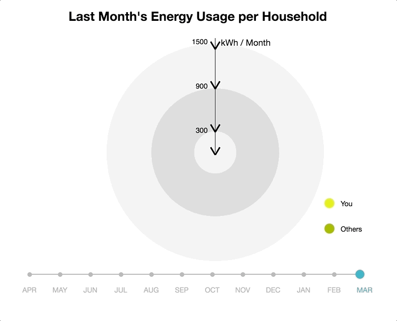
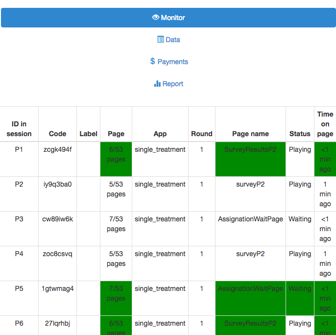
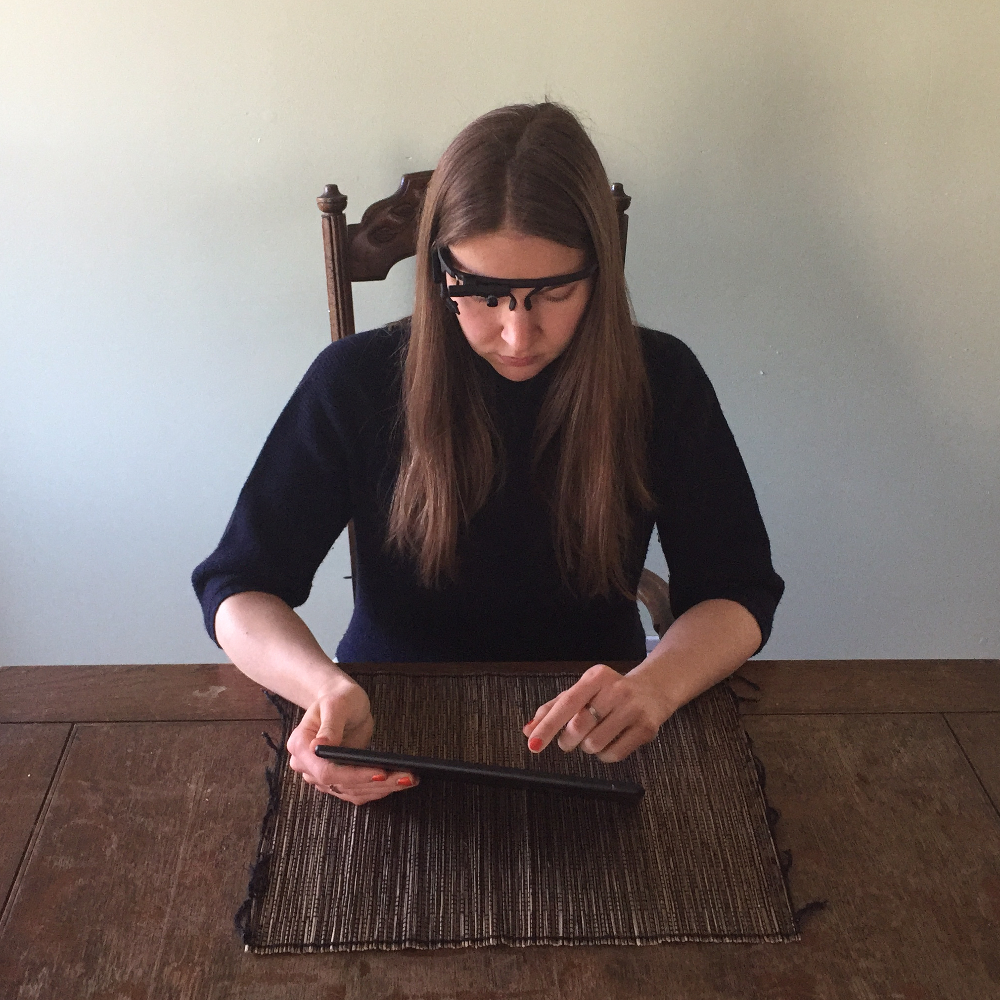
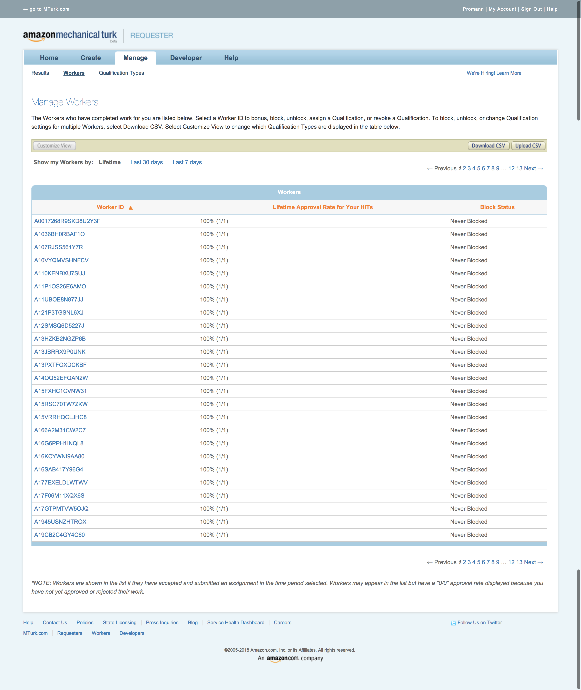
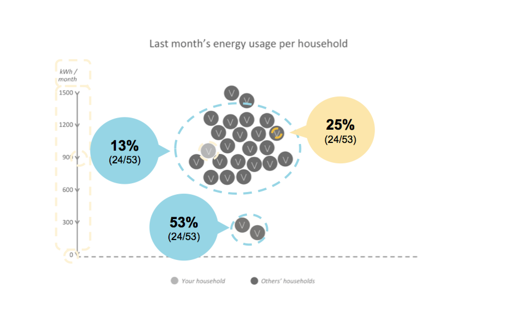
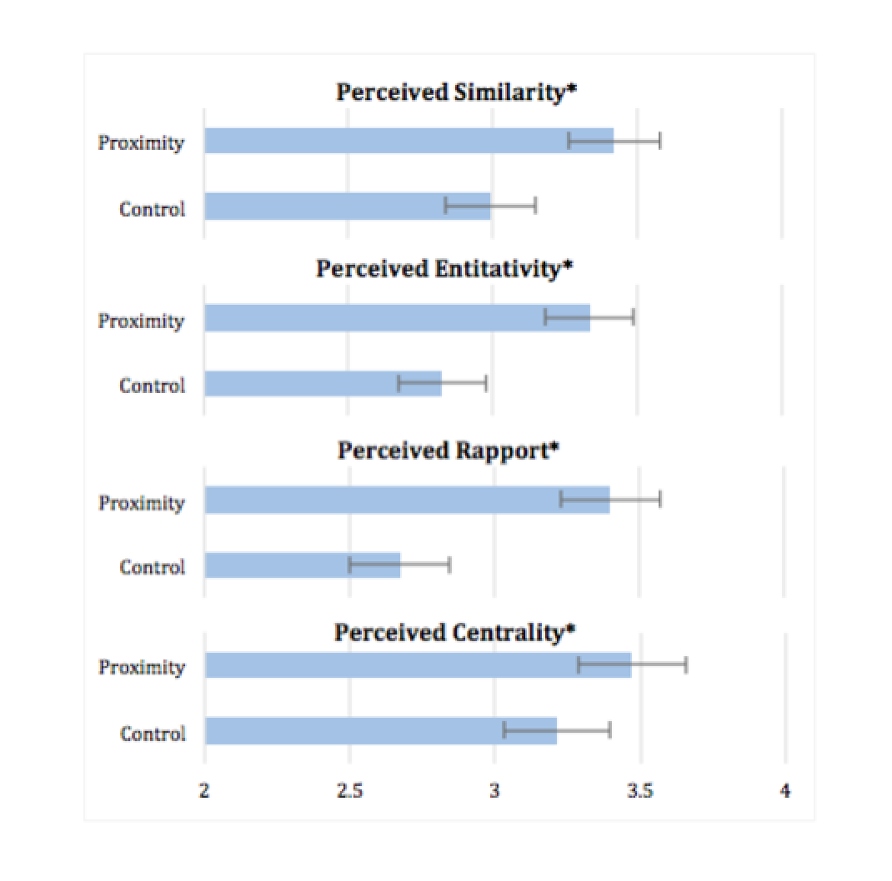
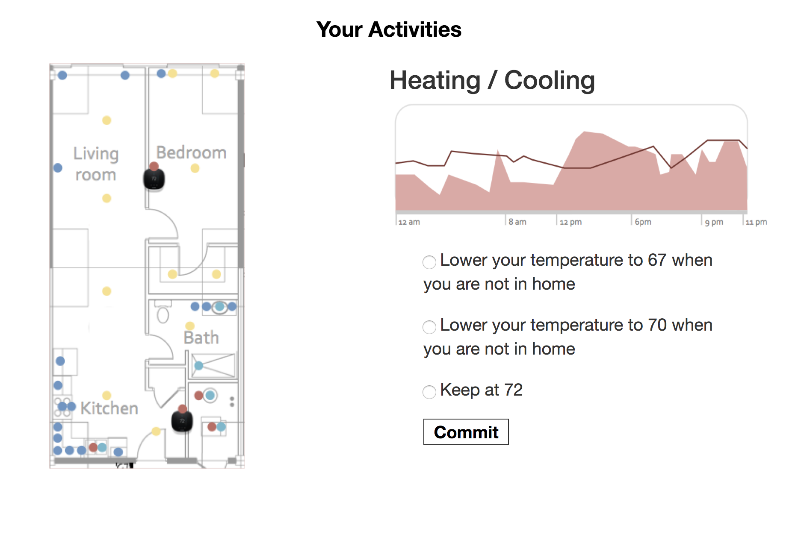


---
## ENERGY/Vis

#### Social Perceptions in Home Energy Graphs

Our information is increasingly data based and our decisions are increasingly guided by data graphs, charts and visualizations. Yet, the dominantly individualist data presentation perspectives utilized in current feedback systems have failed to leverage social behavioral theories to design technologically mediated feedback that could enhance individuals' awareness of and their willingness to cooperate with the digitally interconnected others.

The ENERGY/Vis Project was created to gain deeper insight into how the visual structure of a data graph affects the interpretation and comprehension of the data the chart represents and how they might nudge us to more cooperative choices. Little research has examined the role data visualization design plays in shaping behavior in the context of collective action (e.g., recycling, energy conservation, public protest, juries or organizational committees) that require cooperation and pooling of efforts of individual members, often on a voluntary basis. In such dilemmas, everybody is better off if individuals align with the group goal; however, these tasks typically fail because many do not align with the group's goal. In addition to visual encoding patterns to enhance individuals' social awareness and cooperation, this project will offer resources for new cognitive and perceptual experiments.

## Products and Contributions:

A. One (1) home energy monitoring app.

B. One (1) set of unifying design patterns.

C. One (1) new infovis game model.

D. 10s of new D3.js graphs.

E. 10s of behavioral games.

F. 10s of lab studies.

G. 100s of on Amazon Mechanical Turk workers.

#### Data:

A. 100s of annotations.

B. 100s of perceived group unity measurements.

C. 1,000s of graph descriptions.

D.1,000s of graph based decisions

E. 10,000 of eye fixations

F. 10,000s of code lines( see our Github)

**Request our data:** Email opendigital@purdue.edu

## Our Experiments

Research has shown that data based feedback has the potential to make people more aware and cognizant of their synergy decisions. What is lacking is the consideration of the subtle ways in which design details of data based charts frame how people perceive, understand and act in response to the feedback charts.

We extend visual perception theory by borrowing from group identity literature, which suggests that perceiving a unified group is required for group alignment and continued commitment. So, we hypothesize that seeing and identifying with a perceivably unified group can sustain users' energy conservation efforts. We use social computational methods to study the effects of visual graph structures and motion effects on graph perceptions, interpretations and user actions and consolidate a set of design patterns.

## Perception and Interpretation Experiments.

We marry theories of visual perception and group identity to deliver theory driven chart designs that support collective awareness. Our perceptual experiments explore how these visual graph structures increase the perception of group unity.

[Explore our Gestalt Graphs](https://smartenergygame.github.io/EnergyCharts/index.html)

## Behavioural Game Studies Focused on Action.

We build on existing behavioral game literature and propose a new visualization oriented game framework. We use the behavioral game to explore how the visual graph structures nudge individuals to more cooperative behaviors.

[Demo our behavioral game](https://smart-energy-game.herokuapp.com/demo/)

## Lab Studies with Eye Tracking.

We seek to better understand the link between perceiveinng a data visualization and how interpretinng the unnderlying data is mediated by visual graph structures.

[Explore our Motion Graphs](https://smartenergygame.github.io/EnergyMonitorDemo/)

## Publications
When using our work please cite our papers

A. JOURNAL

**A Framework for Eco-Feedback Design For Home Energy Interactions**

Marlen Promann, and Sabine Brunswicker (2018) ACM Transactions on Computer-Human Interaction, (forthcoming).

Promann, M., & Brunswicker, S. (2017). AIS Electronic Library (AISeL) - AMCIS 2017 Proceedings: Affordances Of Eco-Feedback Design in Home Energy Context. Aisnet.org. https://aisel.aisnet.org/amcis2017/GreenIS/Presentations/7/

B. CONFERENCES

**1. The Effect of Enclosure in Group Charts on Perceived Unity.**

Marlen Promann, and Sabine Brunswicker (forthcoming) CSCW, New Jersey, NY, USA, November 3-7

**2. The Effect of Proximal Data Structure on Perceived Group Unity**

Marlen Promann, and Sabine Brunswicker (forthcoming) IEEEVis VAST, Berlin, Germany, October.

**3. Affordances of Eco-Feedback Design in Home Energy Context**

Marlen Promann, and Sabine Brunswicker (2017) AMCIS, Boston, MA, USA, 10-12 August.

## Say, Hi!

Please reach out to us with feedback, suggestions, data and collaboration requests.

We love this inspiring track of civic design work and look forward to hearing from you.

#### Our Researchers

**Dr. Sabine Brunswicker** - Associate Professor, Director Research Center for Digital Innovation (RCODI) | **[Profile](https://rcodi.org/people/sabine-brunswicker/)**

**Marlen Promman** - PhD Design Researcher, RCODI Research Fellow |  **[Profile](https://rcodi.org/people/marlen-promann/)**

**Jesus Enrique**

**Aldana Sigona**
Game Developer, RCODI Research Fellow | aldana.sigona(at)gmail(dot)com

**Daniel Fernando**

**Santos Bustos** - Software Engineer, RCODI Research Fellow | dfsantosbu(at)unal(dot)edu(dot)co

Note: For graph and game codes, please visit out [GitHub repository.](https://github.com/SmartEnergyGame)

### Acknowledgements

This work has been supported in part by the National Science Foundation (NSF) under Smart and Connected Communities grant, Office of the Executive Vice President for Research at Purdue University, and Purdue Discovery Park's Big Idea Challenge awards. This work has also been made possible by the critical feedback of RCODI team at large.
