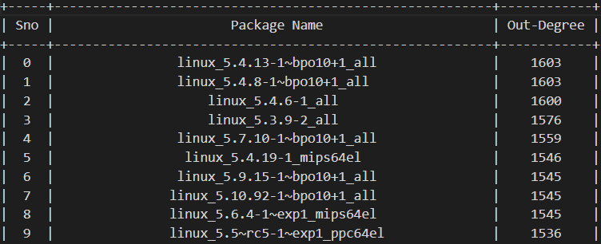

## Introduction

The OSS supply chain has become an essential part of the software development process, enabling organizations to reduce development time and costs by reusing and integrating packages from different OSS products. However, this approach has also increased the risk of security vulnerabilities and software attacks compromising the confidentiality, integrity, and availability of sensitive data and system operations. 

Organizations must identify, assess, and manage the risks associated with OSS components by utilizing software risk management techniques to mitigate these risks. By adopting a structured approach, organizations can evaluate the potential risks of OSS components and make informed decisions regarding their use. 

One significant risk associated with the OSS supply chain is the interdependencies between various packages. This interconnectedness can allow attackers to exploit the system and gain unauthorized access to sensitive data or systems. Organizations must understand the potential risks of these interdependencies and take proactive measures to mitigate them. 

In addition to security vulnerabilities, non-compliance with open-source licenses is another risk organizations must consider when using OSS components. Failure to comply with open-source licenses can result in legal action and damage the organization's reputation. Thus, it is crucial to assess the risks related to non-compliance and take appropriate measures to mitigate them. 

## Project Description 

Our project aims to address the emerging threat of software supply chain vulnerabilities by utilizing network science methods. To achieve this goal, we are collecting and analyzing various representative supply chain datasets, which include package popularity, build provenance, and maintainers of Debian packages, which provide valuable insights into the structural properties of these supply chains. 

Using the acquired data, we are constructing various models to visualize and assess the risks associated with software supply chain susceptibilities. These models help identify potential weaknesses and interdependencies in the supply chain, enabling organizations to mitigate the risks proactively. Using network science methods, we are trying to identify patterns and anomalies in the data that are difficult to detect using traditional security techniques. 

The use of network science methods in software supply chain security is an innovative approach that can revolutionize how organizations detect and prevent software supply chain vulnerabilities. By leveraging the power of data analytics and visualization, we aims to provide organizations with a new toolset to enhance their security posture and protect their systems from sophisticated cyber threats.

Based on our initial findings (from above figure), we have identified that kernel builds are the most interconnected in our dataset. Furthermore, we have observed that specific versions of these kernel builds are used more frequently than others. We were surprised to see older versions with higher connectivity, as well as different processor architectures (e.g., MIPS), being more connected than other architectures such as x86_64 or ARM.

Our analysis also suggests that based on the out-degree metric, these highly connected kernel builds pose a higher risk. Therefore, it will be vital for us to focus our attention on understanding these kernel builds in more detail and assessing any potential vulnerabilities or security risks associated with them. These preliminary results highlight the importance of conducting thorough analyses of interconnected systems to identify potential risks and inform effective risk management strategies.
