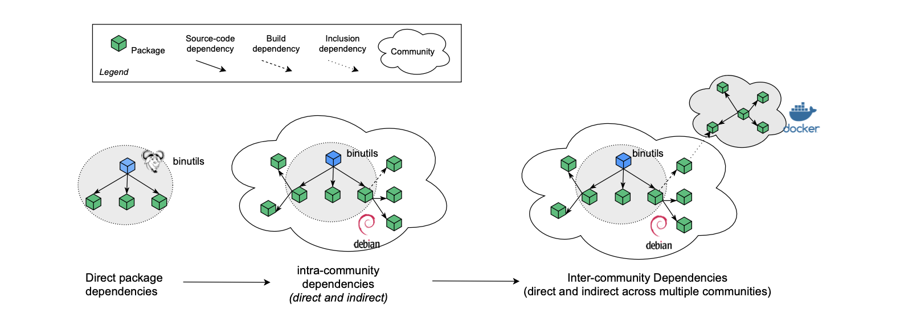

## What's GUAC-ALYTICS? 
This research project aims to increase increase the transparency about Complex Open Source Software Supply-Chains using theories and models of network science and machine learning. 
An open source is software whose source code is available to anyone to view, use, modify, and distribute. It is created and maintained by a community of developers and users collaborating to improve the software. Open-source packages are pre-built pieces of software that can be used to build other applications. They can be freely downloaded from repositories such as GitHub or npm, making them an essential part of software development.

However, like any other software, open-source packages can contain vulnerabilities that attackers can exploit. Vulnerabilities are weaknesses or flaws in software or hardware systems that attackers can use to gain unauthorized access or control over the system. Vulnerabilities can be introduced during the development process or added by third-party dependencies. These vulnerabilities can pose severe risks to software systems, ranging from data breaches to system failures. Therefore, it is essential to manage and monitor open-source software and packages for vulnerabilities (Zapata et al., 2018; Duan, 2020) and take necessary measures to mitigate potential risks.

In cyber-security, a security compromise (IQTLabs, n.d.) refers to a violation of security expectations in a software product that causes harm to its users. These violations may be caused by various actions (or inactions) that include operator misbehaviour (e.g., insider threats), operator negligence and outsider threats (e.g., a malicious hacker exploiting a security vulnerability). The security expectations are confidentiality (or privacy), integrity, and availability of computer software and services. 

## Why GUAC-ALYTICS of OSS
Open Source Software (OSS) (Mair, 2022) has become an essential part of the software development process, enabling organizations to reduce development time and costs by reusing and integrating packages from different OSS products. However, recent studies have revealed that around 80% of software contains OSS components, increasing the risks associated with OSS supply chain interdependencies. In addition, while this approach offers significant benefits, it has also raised concerns about security vulnerabilities and software attacks that could compromise sensitive data and system operations.

One of the most significant challenges of OSS development is the large community of contributors like Debian (Debian – the Universal Operating System, 2022b) involved in maintaining it, which makes it challenging to identify and patch vulnerabilities promptly and effectively. Furthermore, OSS often relies on third-party libraries and components (Ohm et al., 2020), which can introduce additional vulnerabilities. The OSS supply-chain network graph above represents multiple dependencies between packages, making it difficult for individual developers to understand the interdependencies and potential vulnerabilities introduced by such dependencies.

The SolarWinds hack (Jena, 2023) is one example of the risks associated with OSS-related security incidents. This attack exploited vulnerabilities in the software supply chain to infiltrate multiple government agencies and private companies. Therefore, it is critical to understand the interdependencies and potential risks introduced by such dependencies to ensure the overall security of the software.

Our theoretical contribution is to evaluate the risks associated with OSS supply chain interdependencies (Zerouali et al., 2021). The risks associated with OSS components, such as the possibility of security vulnerabilities and non-compliance with open-source licenses, can be identified, assessed, and managed using these approaches (Ponta et al., 2020). Utilizing software risk management approaches can give organizations a structured way to assess the risks related to OSS components and support them in making decisions (Kikas et al., 2017). It also helps to track the vulnerabilities through all the related dependencies so that developers can identify and patch them quickly across different platforms (Zimmermann, 2019). By identifying and assessing the risks associated with OSS components, organizations can make informed decisions and implement robust security measures to mitigate these risks.

## Approach
Using network science methods (Izenman, 2023) in software supply chain security is an innovative approach that can revolutionize how organizations detect and prevent software supply chain vulnerabilities. By leveraging the power of data analytics and visualization, we aim to provide organizations with a new toolset to enhance their security posture and protect their systems from sophisticated cyber threats. To achieve this goal, we collect and analyze various representative supply chain datasets, including package popularity (Debian Popularity Contest, n.d.), build provenance (Index Of /, n.d.), and maintainers of open-source ecosystems. These datasets provide valuable insights into the structural properties of these supply chains.

Using the acquired data, we construct various models to visualize and assess the risks associated with software supply chain susceptibilities. These models help identify potential weaknesses and interdependencies in the supply chain, enabling organizations to mitigate the risks proactively. In addition, using network science methods, we are trying to identify patterns and anomalies in the data that are difficult to detect using traditional security techniques.

## Preliminary Results

Based on our initial findings, we have identified that kernel builds (Wikipedia contributors, 2023) are the most interconnected in our dataset. Furthermore, we have observed that specific versions of these kernel builds are used more frequently than others. We were surprised to see older versions with higher connectivity and different processor architectures (e.g., MIPS - processor of routers, set-up boxes) more connected than others, such as x86_64 (architecture of Intel's 64-bit CPUs) or ARM (architecture of Apple's chip).

Our analysis also suggests that this highly connected kernel builds pose a higher risk based on the out-degree metric (Node Degree Definition - Math Insight, n.d.). Therefore, it will be vital for us to focus our attention on understanding these kernel builds in more detail and assessing any potential vulnerabilities or security risks associated with them. These preliminary results highlight the importance of conducting thorough analyses of interconnected systems to identify potential risks and inform effective risk management strategies.

## Intellectual Merit and Broader Impact
The intellectual merit lies in our contribution to understanding and predicting the structure and risks within OSS supply chain ecosystems. It describes the social and technical interdependencies between complex systems and advances them in the OSS supply-chain context. Our research proposes a socio-technical network perspective to represent and analyze the complexity and inherent risks of the OSS supply chain. We leverage empirical data from OSS communities to construct temporal networks of OSS supply chains and use efficient algorithms for network mining to analyze them. We also propose to model and value the structural risks of a package within the OSS supply chain ecosystem to identify critical packages that create high risks for the repository and the ecosystem as a whole.

The broader impact of this research is mainly on software engineering and cyber security. Our research can help software engineers to identify critical packages that create high risks for the repository and the ecosystem. It can also help develop more effective security standards and best practices. Finally, it also helps to identify and mitigate the risks associated with using open-source software in cybersecurity. 

## References and Citations

- Node degree definition - Math Insight. (n.d.). https://mathinsight.org/definition/node_degree
- Mair, D. (2022, November 21). Understanding open source software supply chain risks. https://www.redhat.com/en/blog/understanding-open-source-software-supply-chain-risks
- Jena, B. K. (2023, February 28). SolarWinds Attack And All The Details You Need To Know About It. Simplilearn.com. https://www.simplilearn.com/tutorials/cryptography-tutorial/all-about-solarwinds-attack
- Debian -- The Universal Operating System. (2022b, December 17). https://www.debian.org/
- IQTLabs. (n.d.). GitHub - IQTLabs/software-supply-chain-compromises: A dataset of software supply chain compromises. Please help us maintain it! GitHub. https://github.com/IQTLabs/software-supply-chain-compromises
- Debian Popularity Contest. (n.d.). https://popcon.debian.org/
- Index of /. (n.d.). https://buildinfos.debian.net/
- Izenman, A. J. (2023, January 5). Network Models for Data Science. https://doi.org/10.1017/9781108886666
- Wikipedia contributors. (2023, March 11). Debian version history. Wikipedia. https://en.wikipedia.org/wiki/Debian_version_history
- Duan, R. (2020, February 4). Towards Measuring Supply Chain Attacks on Package Managers for Interpreted Languages. arXiv.org. https://arxiv.org/abs/2002.01139
- Zapata, R. E., Kula, R. G., Chinthanet, B., Ishio, T., Matsumoto, K., & Ihara, A. (2018). Towards Smoother Library Migrations: A Look at Vulnerable Dependency Migrations at Function Level for npm JavaScript Packages. International Conference on Software Maintenance. https://doi.org/10.1109/icsme.2018.00067
- Kikas, R., Gousios, G., Dumas, M., & Pfahl, D. (2017). Structure and Evolution of Package Dependency Networks. Mining Software Repositories. https://doi.org/10.1109/msr.2017.55
- Zimmermann, M., Staicu, C. A., Tenny, C., & Pradel, M. (2019, August). Small World with High Risks: A Study of Security Threats in the npm Ecosystem. In USENIX security symposium (Vol. 17).
- Zerouali, A., Mens, T., Decan, A., & De Roover, C. (2021). On the impact of security vulnerabilities in the npm and RubyGems dependency networks. Empirical Software Engineering, 27(5). https://doi.org/10.1007/s10664-022-10154-1
- Ponta, S. E., Plate, H., & Sabetta, A. (2020). Detection, assessment and mitigation of vulnerabilities in open source dependencies. Empirical Software Engineering, 25(5), 3175–3215. https://doi.org/10.1007/s10664-020-09830-x
- Ohm, M., Plate, H., Sykosch, A., & Tam, K. C. (2020). Backstabber’s Knife Collection: A Review of Open Source Software Supply Chain Attacks. Lecture Notes in Computer Science, 23–43. https://doi.org/10.1007/978-3-030-52683-2_2
