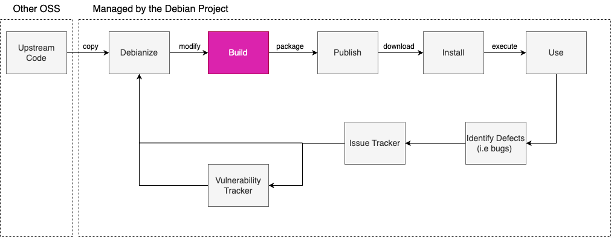
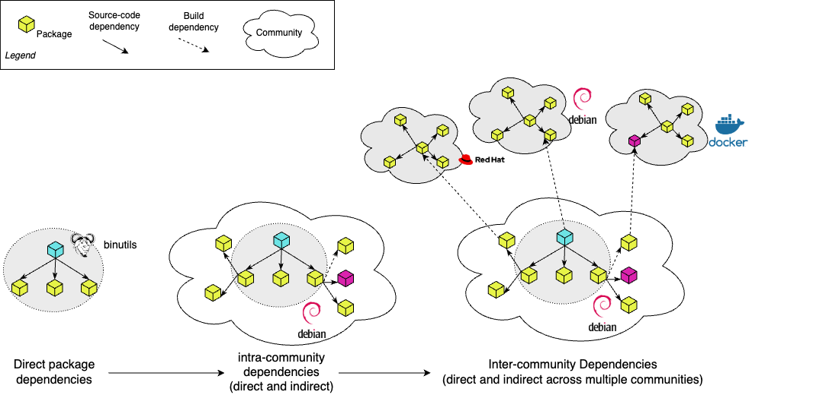

## What's GUAC-ALYTICS? 
Software supply chain attacks, a form of software compromise (MITRE ATT&CK®, 2023) refers to a violation of security expectations in a software product that causes harm to its users. These violations may be caused by various actions (or inactions) that include operator misbehaviour (e.g., insider threats), operator negligence and outsider threats (e.g., a malicious hacker exploiting a security vulnerability). The security expectations are confidentiality (or privacy), integrity, and availability of computer software and services. These are increasingly-worrying risks for both open-source and closed-source software. According to estimates, this attack vector loses millions of dollars yearly (Software Supply Chain Compromises - A Living Dataset, 2020/2023). These attacks occur due to the lack of visibility into what software is used and how it moves throughout the supply chain. In other words, there is a dire need to _study and model software supply chain security risks_.

The **GUAC-ALYTICS** program aims to increase the transparency of Complex Open Source Software (OSS) Supply-chains using theories and models of network science (Izenman, 2023) and machine learning. In OSS, the software's source code is available to anyone to view, use, modify, and distribute. It is created and maintained by a community of developers and users collaborating to improve the software. Open-source packages are pre-built pieces of software that can be used to build other applications. They can be freely downloaded from repositories such as GitHub or npm, making them an essential part of software development. With the rise of OSS, the software has impacted how individuals and organizations move through the software supply chain, including activities such as source code development, building & packaging, re-configuration & re-packaging (e.g., containerizing), and deployment. Today almost every software vendor – whether a small start-up or a large corporation like Microsoft, IBM, Google or RedHat – reuses and integrates packages from freely-available OSS products when moving through this chain (Open Source Security and Analysis Report, 2023). Figure 1 below shows the supply chain of Debian, a popular operating software developed by a large community of OSS developers (Debian – the Universal Operating System, 2022).

Figure 1: Supply Chain of the Debian Ecosystem

However, like any other software, open-source packages can contain **vulnerabilities** and **compromises** that attackers can exploit. Vulnerabilities are weaknesses or flaws in software or hardware systems that attackers can use to gain unauthorized access or control over the system. Vulnerabilities can be introduced during the development process or added by third-party dependencies. These vulnerabilities can pose severe risks to software systems, ranging from data breaches to system failures. We refer to risk as the influence of a node in the OSS supply chain on the security of the overall software system.  The risk of security vulnerabilities and attacks arises due to the interdependencies between the various parts of the OSS supply chain. Therefore, it is essential to manage and monitor open-source software and packages for vulnerabilities (Zapata et al., 2018; Duan, 2020) and take necessary measures to mitigate potential risks.

Guac-alytics builds on top of the **[GUAC project (Graph for Understanding Artifact Composition)](https://github.com/guacsec/guac)** in collaboration with Google and Kusari (GUAC, 2022/2023). This research project develops new theories, models, and technologies for modeling OSS supply-chain risk. It also aims to produce a collection of tools and resources designed to help researchers and practitioners better understand the risk profile of the open-source software supply-chain.

## Why a network view towards OSS supply-chain risk modeling? 
Open Source Software (OSS) (Mair, 2022) has become an essential part of the software development process, enabling organizations to reduce development time and costs by reusing and integrating packages from different OSS products. Recent studies have revealed that around 80% of software contains OSS components. However, this also increases the risks associated with OSS supply chain interdependencies. These interdependencies have also raised concerns about security vulnerabilities and software attacks that could compromise sensitive data and system operations.

Figure 2: OSS Supply Chain Ecosystem as Network of Interdependent Packages

One of the most significant challenges of OSS development is the large community of contributors like Debian (Debian – the Universal Operating System, 2022), which is involved in maintaining it, which makes it challenging to identify and patch vulnerabilities promptly and effectively. Furthermore, OSS often relies on third-party libraries and components (Ohm et al., 2020), which can introduce additional vulnerabilities. Figure 2 above represents multiple dependencies between packages, making it difficult for individual developers to understand the interdependencies and potential vulnerabilities introduced by such dependencies.

The SolarWinds hack (Jena, 2023) is one example of the risks associated with OSS-related security incidents (Software Supply Chain Compromises - A Living Dataset, 2020/2023). This attack exploited vulnerabilities in the software supply chain to infiltrate multiple government agencies and private companies. Therefore, it is critical to understand the interdependencies and potential risks introduced by such dependencies to ensure the overall security of the software.

A network view towards modeling risks allows us to identify certain components and packages' "hidden" influence in the OSS supply chain (Zerouali et al., 2021). In other words, a network view allows us to model how information "propagates through" the OSS supply-chain because of various complex direct and indirect interdependencies between packages and components (Brunswicker & Mukherjee, 2023). It offers us a new way to model risk associated with OSS components distinct from past approaches for modeling risk. It not only allows us to identify security vulnerabilities that result from non-compliance with open-source licenses (Ponta et al., 2020) but also allows us to identify how influential a particular component/package is in propagating compromises. For example, a component used during the build process of many other components will have a higher impact on the propagation of vulnerabilities: Once attacked, it may affect a broader range of other packages and organizations. Utilizing a networked-base software risk management approach can give organizations a structured way to assess the risks related to OSS components and support them in making decisions (Kikas et al., 2017). It also helps to track the vulnerabilities through all the related dependencies so that developers can identify and patch them quickly across different platforms (Zimmermann, 2019).

## Our Research Approach
To achieve this goal, we collect and analyze various representative supply chain datasets, including package popularity (Debian Popularity Contest, 2023), build provenance (Buildinfos, 2023), and maintainers of open-source ecosystems. These datasets provide valuable insights into the structural properties of these supply chains.

Our approach involves constructing temporal networks to model open-source software (OSS) supply chains using supply-chain trace data collected from the build provenance (Buildinfos, 2023) database. In these networks, each node represents a package, and each edge represents a supply-chain interdependence between two packages. These the node attributes are the popularity and vulnerability measures of each package. The networks we construct will be directed, meaning that the edges have a specific direction indicating the flow of dependencies between packages over time. Also, we define a package’s security risk as the likelihood and the impact of a potential software compromise for that particular package. These models help identify potential weaknesses and interdependencies in the supply chain, enabling organizations to mitigate the risks proactively. In addition, using network science methods, we are trying to identify patterns and anomalies in the data that are difficult to detect using traditional security techniques.

## Preliminary Results

Figure 3: Top 20 packages based on the out-degree metric

Based on our initial findings, we have identified that kernel builds (Wikipedia contributors, 2023) are the most interconnected in our dataset. Furthermore, we have observed that specific versions of these kernel builds are used more frequently than others. We were surprised to see older versions with higher connectivity and different processor architectures (e.g., MIPS - processor of routers, set-up boxes) more connected than others, such as x86_64 (architecture of Intel's 64-bit CPUs) or ARM (architecture of Apple's chip).

Our analysis from Figure 3 also suggests that these highly connected kernel builds pose a higher risk based on the out-degree metric (Node Degree Definition - Math Insight, 2023). Therefore, it will be vital for us to focus our attention on understanding these kernel builds in more detail and assessing any potential vulnerabilities or security risks associated with them. These preliminary results highlight the importance of conducting thorough analyses of interconnected systems to identify potential risks and inform effective risk management strategies.

## Intellectual Merit and Broader Impact
The intellectual merit lies in our contribution to understanding and predicting the structure and risks within open-source software (OSS) supply chain ecosystems. It describes the social and technical interdependencies between complex systems and advances them in the OSS supply-chain context. Our research proposes a socio-technical network perspective to represent and analyze the complexity and inherent risks of the OSS supply chain. We leverage empirical data from OSS communities to construct temporal networks of OSS supply chains and use efficient algorithms for network mining to analyze them. We also propose to model and value the structural risks of a package within the OSS supply chain ecosystem to identify critical packages that create high risks for the repository and the ecosystem as a whole.

The broader impact of this research is mainly on software engineering and cyber security. Our research can help software engineers to identify critical packages that create high risks for the repository and the ecosystem. It can also help develop more effective security standards and best practices. Finally, it also helps to identify and mitigate the risks associated with using open-source software in cybersecurity. 

## Future Work

Given the prevalence of supply chain attacks has been on the rise, it is crucial to develop better tools and techniques to mitigate security risks in the OSS supply chain. Our proposed method and existing solutions have made significant progress, but managing dependencies remains a major issue in the OSS supply chain. The complexity of dependencies in a typical OSS project makes tracking and managing them challenging.

To overcome this challenge, our future work will focus on developing new approaches to manage dependencies more effectively. One potential solution is to use core-periphery techniques, such as Rossa (Della Rossa et al., 2013), Rombach (Rombach et al., 2014), and Minres (Boyd et al., 2010), and concentrate more on the hidden core structures (Baldwin et al., 2014) of the dependency graphs which provide a more comprehensive view of the dependencies. By visualizing the dependencies more meaningfully, these graphs can help identify potential vulnerabilities in OSS components more quickly and accurately.

We want to create a more secure OSS supply chain by developing these new approaches. This will enable developers to detect and mitigate security risks more efficiently and effectively, leading to safer and more trustworthy OSS projects. Ultimately, our goal is to help build a more resilient OSS community to withstand the growing threat of supply chain attacks.

## References and Citations

- MITRE ATT&CK®. (2023). https://attack.mitre.org/ 
- Open Source Security and Analysis Report. (2023). https://www.synopsys.com/software-integrity/resources/analyst-reports/open-source-security-risk-analysis.html
- Debian -- The Universal Operating System. (2022). https://www.debian.org/
- Software Supply Chain Compromises - A Living Dataset (2020/2023). GitHub - IQTLabs/software-supply-chain-compromises: A dataset of software supply chain compromises. https://github.com/IQTLabs/software-supply-chain-compromises
- Duan, R. (2020, February 4). Towards Measuring Supply Chain Attacks on Package Managers for Interpreted Languages. arXiv.org. https://arxiv.org/abs/2002.01139
- Zapata, R. E., Kula, R. G., Chinthanet, B., Ishio, T., Matsumoto, K., & Ihara, A. (2018). Towards Smoother Library Migrations: A Look at Vulnerable Dependency Migrations at Function Level for npm JavaScript Packages. International Conference on Software Maintenance. https://doi.org/10.1109/icsme.2018.00067
- GUAC (2022/2023). GitHub - guacsec/guac: GUAC aggregates software security metadata into a high fidelity graph database. GitHub. https://github.com/guacsec/guac
- Mair, D. (2022, November 21). Understanding open source software supply chain risks. https://www.redhat.com/en/blog/understanding-open-source-software-supply-chain-risks
- Ohm, M., Plate, H., Sykosch, A., & Tam, K. C. (2020). Backstabber’s Knife Collection: A Review of Open Source Software Supply Chain Attacks. Lecture Notes in Computer Science, 23–43. https://doi.org/10.1007/978-3-030-52683-2_2
- Jena, B. K. (2023). SolarWinds Attack And All The Details You Need To Know About It. Simplilearn.com. https://www.simplilearn.com/tutorials/cryptography-tutorial/all-about-solarwinds-attack
- Zerouali, A., Mens, T., Decan, A., & De Roover, C. (2021). On the impact of security vulnerabilities in the npm and RubyGems dependency networks. Empirical Software Engineering, 27(5). https://doi.org/10.1007/s10664-022-10154-1
- Brunswicker, S., & Mukherjee, S. (2023). The microstructure of modularity in design: a design motif view. Industrial and Corporate Change.
- Ponta, S. E., Plate, H., & Sabetta, A. (2020). Detection, assessment and mitigation of vulnerabilities in open source dependencies. Empirical Software Engineering, 25(5), 3175–3215. https://doi.org/10.1007/s10664-020-09830-x
- Kikas, R., Gousios, G., Dumas, M., & Pfahl, D. (2017). Structure and Evolution of Package Dependency Networks. Mining Software Repositories. https://doi.org/10.1109/msr.2017.55
- Zimmermann, M., Staicu, C. A., Tenny, C., & Pradel, M. (2019, August). Small World with High Risks: A Study of Security Threats in the npm Ecosystem. In USENIX security symposium (Vol. 17).
- Debian Popularity Contest. (2023). https://popcon.debian.org/
- Izenman, A. J. (2023, January 5). Network Models for Data Science. https://doi.org/10.1017/9781108886666
- Buildinfos. (2023). https://buildinfos.debian.net/
- Wikipedia contributors. (2023, March 11). Debian version history. Wikipedia. https://en.wikipedia.org/wiki/Debian_version_history
- Node degree definition - Math Insight. (2023). https://mathinsight.org/definition/node_degree
- Rombach, M. P., Porter, M. A., Fowler, J. H., & Mucha, P. J. (2014). Core-Periphery Structure in Networks. Siam Journal on Applied Mathematics, 74(1), 167–190. https://doi.org/10.1137/120881683
- Della Rossa, F., Dercole, F., & Piccardi, C. (2013). Profiling core-periphery network structure by random walkers. Scientific Reports, 3(1). https://doi.org/10.1038/srep01467
- Boyd, J. D., Fitzgerald, W. F., Mahutga, M. C., & Smith, D. (2010). Computing continuous core/periphery structures for social relations data with MINRES/SVD. Social Networks, 32(2), 125–137. https://doi.org/10.1016/j.socnet.2009.09.003
- Baldwin, C. Y., MacCormack, A., & Rusnak, J. (2014). Hidden structure: Using network methods to map system architecture. Research Policy, 43(8), 1381–1397. https://doi.org/10.1016/j.respol.2014.05.004
