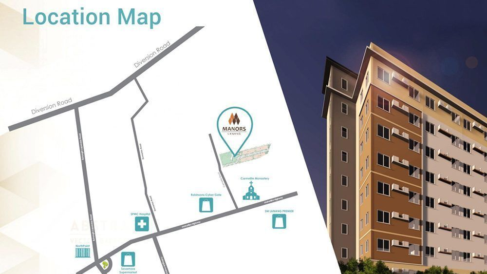

## What is IronHacks?

IronHacks is a global virtual open data hacking program that empowers programmers - from beginners to professionals - to solve civic challenges during a multi-phase and learning-oriented process.  The IronHacks platform offers participants a no-set-up programming environment and many powerful features to create novel and useful models and visualizations that help citizens and governments to make better decisions.

## Example challenges

### COVID-19 Data Science Challenge

Use data provided by suppliers such as SafeGraph to predict areas that will be impacted by  COVID-19 based on foot traffic.
What are the Challenges about?

Our COVID-19 Data Science Challenges invite participants to build statistical models and visualizations that monitor and predict social movement behavior during the COVID-19 pandemic over time. The goal is to predict weekly patterns of movement and social interaction in our local communities to understand COVID-19 risks.

    August 2020 COVID-19 Data Science Challenge: This first COVID-19 Data Science Challenge focuses on predicting the foot traffic at major brands (e.g. Target, Domino's Pizza etc.). The goal is to foresee which brands are experiencing the greatest surge in visitors.
    Fall 2020 COVID-19 Data Science Challenge: Protect Purdue. This challenge asks participants to monitor and predict weekly foot traffic at thousands of places of interests (e.g. restaurants, stores, churches) in the Greater West-Lafayette. It responds to a statement made by Purdue's Leadership team: that COVID-19 risk is not necessarily arising in campus buildings but, rather, emerging from off-campus social gatherings like in restaurants, shops, etc.

Participants have access to BIG actual, granular and temporal data they typically do not have access to: Data about social distancing behavior, foot traffic, COVID-19 incidents, as well as executive orders. This data is also used by state governments in the US as well scientists who try to understand social movements during COVID-19 pandemic.

Equipped with this data, participants will work in the IronHacks workspace with JupyterLab and access to BigQuery to create novel and useful statistical models and visualizations using Python and R. Participants will submit Jupyter notebooks and their outputs (html and markdown files).

### AFFORDABLE HOUSING

Build a website with interactive visualizations that helps new students in finding safe and affordable housing near their university.

### WORKFORCE ANALYTICS

Use workforce data to explore factors that affect successful career paths.

---

## How does the process work?

IronHacks is a global virtual open data hacking platform that allows users to participate in a high-energy IronHacks competition. The IronHacks platform offers participants a no setup workspace with JupyterLab and BigQueryintegration and many powerful features to create novel and useful models and visualizations. It also offers training and tutorials, as well as a personal dashboard to view scores and progress through the competition. After registration, participants can warm-up, practice their skills and query sample data until sufficient participants have joined to launch the competition. After the start of the competition, a multiphase process will start. Each challenge moves through the following phases.

    Registration and warm-up phase: If you have registered for one of the Challenges that are available, you will have the opportunity to warm-up using our tutorials.
    Start of competition followed by multiphase process: The competition starts based on invitation, usually followed by multiple interim and one final submission
        Interim submissions: At multiple interim submission points, you will receive immediate feedback on your current standing, giving you the opportunity to improve over time.
        Final submission: There will be a final submission before we identify the winners.

## Our Impact

The scientific team at Purdue generated new knowledge and technologies on the implications of machine-enabled feedback and transparency on participant's productivity and innovation performance.

Since 2015, thousands of participants have hacked in parallel virtually around the globe gaining valuable experience in coding as well as work for the chance to win internships, Amazon gift cards, cool swag, and certificates. In addition to the students participation and learning, IronHacks provide the opportunity to do research on open innovation contest processes.

Participants developed novel and useful open data solutions in an interactive environment. The platform's features helped them continuously improve their submissions while learning from real-time feedback and others participating in the hack. A new virtual movement of hacking has emerged at Purdue and beyond. Participants come from the U.S., Colombia, and China. Virtual setting encourages a more diverse audience.

## Learn More

## About IronHacks

[Sign up on our Website](https://www.ironhacks.com/)

[Online walkthrough](https://www.youtube.com/watch?v=8YLLXMhtTB4)

Interested in partnering or have a question?
[Email us](mailto:sbrunswi@purdue.edu)
[Connect with us](https://www.facebook.com/OpenDigitalPurdue/)
