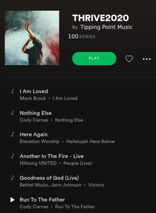

## The Tipping Point Community Platform for a &#x201C;Music for Social Change&#x201D; Challenge

*Powered by RCODI IronHacks*

## Why do we need it? 

Science has shown that music can bond people together and motivate them to act collectively. What if during this time of potential ecological and societal collapse, we can use the potential of music to save our future? What if music could trigger ***social tipping points***, thresholds at which the actions of a few artists and their fan base engage the masses to act actively in order to realize social change? 

And there are young artists who want their art to go beyond &#x201C;feel good music&#x201D; and inspire meaningful actions from and with their followers.&#xA0;However, popular metrics such as Billboard Top 100 do not give them sufficient capacity for their songs to become a **Call to Action**.

We, the [Research Center for Open Digital Innovation  (RCODI)](http://www.rcodi.org) and its members and fellows, have joined forces with the [EARTHwise Centre](http://www.earthwisecenter.org) to change this.  

**OUR VISION:**  Every artist should have access to a community platform to co-create songs that ignite collective action for a thrivable world.

---

## **For whom is it? **

Our digital platform connects three key actors to co-create a playlist of songs that call a global audience to take action for social change.

- **Artists**
(musicians, cultural creatives) who co-create songs throughout an iterative process
- **Advisors**
 (experts in &#x201C;thrivability&#x201D; focused not only on sustainability but also social and human capital to regenerate planetary, social, cognitive as well as spiritual resources) who advise artists in defining their call for action 
- **Listeners**
(you, me, and people around the world) who help artists to learn about the potential of their lyrics and sounds to motivate others to follow their call for action

---

## **The key features**

The community platform offers artists a range of novel features to create songs that ignite action: 

- **OUR SONGS**: Access to the community&#x2019;s co-created songs prior to the global release of the tipping point playlist (e.g. via Spotify)
- **MY STUDIO:** A space to create and upload different versions of an artist&#x2019;s song (its audio, its narrative) with features to implement the song&#x2019;s call for actions (e.g. donations related to the song)
- **MY RESULTS:** Access to feedback from advisors and listeners as well as access to song analytics (e.g. 
&#x201C;danceability&#x201D;, listener engagement)
- **MY SOCIAL NETWORK**: Access to a discussion forum to engage in the dialogue with like-minded artists who want to thrive
- **MY LAB: **Tools and tutorials to learn about digital music production, &#x201C;thrivability,&#x201D; and more 

---

## The benefits for artists

1. Join a community of creatives for social change
2. Co-create a song that calls for action
3. Select a curated global initiatives  (e.g. charity or fund) to implement your song&#x2019;s call for action
4. Have your song featured in the Tipping Point channels and playlists

## The research and tech development

Our interdisciplinary team of scientists, designers, artists, and platform engineers (more details[ here](https://docs.google.com/presentation/d/1n-Fgy11di6IUmD8QZKqbZMjFCTDsacnTp8DyCqJSbhc/edit?usp=sharing)) can build upon several years of scientific research and practical development experiences on how to design digital platforms for co-creation and collective action. We have worked with thousands of individuals and hackers around the world to scientifically validate platform features, incentive systems, social technologies, and interface designs for co-creation. Such efforts were supported by the [National Science Foundation](http://www.nsf.org) and donations from industry leaders who are convinced that digital technologies can democratize innovation. 

In the next few months, we build upon these foundations to design and built the first version of the tipping point community platform. It will use state of the art of web technologies (MERN stack), data science techniques, and AI models (e.g. natural language processing, deep learning, network analytics, agent-based modeling). Our goal is to launch it in summer/fall 2020 along with a global call for the music for social change challenge. This platform will also be the foundation of a multi-year research program focused on the 1) role of music for collective action, 2) the nature of social tipping points in the context of thrivability, and 3) the constituting tole of digital technologies and information design for enabling collective action. You can learn more about the research program [here](https://docs.google.com/presentation/d/1n-Fgy11di6IUmD8QZKqbZMjFCTDsacnTp8DyCqJSbhc/edit?usp=sharing).  

---

## Our intended impact

Our goal is that with the launch of a music for social change challenge in fall 2020, we can make impact and: 

1. Involve thousands of artists in the co-creation challenge
2. Create and release a final Spotify playlist with 100 songs calling for collective action across multiple dimensions of social change (e.g. related to different [sustainability development goals](https://sustainabledevelopment.un.org/sdgs) of the United Nations)
3. Develop new sound and text analytics features (based on machine and deep learning methods) measuring the the latent properties of songs that explains the songs&#x2019; potential to enable coherent actions for social change
4. Use the platform as a &#x201C;living lab&#x201D; to understand what features of the platform can *unify* the emotions and actions of thousands of people (despite their geographic, cultural, and social differences)
5. Enable and predict social tipping points &#x2013; thresholds at which songs become viral and motivate the masses to take actions for the social good 

---

## Support our vision 

RCODI and the [EARTHwise Centre](http://www.earthwise.org) calls for your support to make this vision reality. Every donation counts so that we can launch the global music for social change challenge soon. Visit [earthwisecentre.org/music-for-change](https://www.earthwisecentre.org/music-for-change) to support our efforts to use science and music to transform our future. 

Join people around the world and create Your Song of Action. Creating actionable lyrics, melodies, and songs for regenerating Mother Earth and co-creating a world that works for all.

For more information visit [**earthwisecentre.org/music-for-change**](https://www.earthwisecentre.org/music-for-change)

---
